## Load data[ Crime_Data_from_2020_to_Present.csv] this is the Raw data


```python
import pandas as pd
import matplotlib.pyplot as plt

crime = pd.read_csv('Data for Python course/Crime_Data_from_2020_to_Present.csv')
```


```python
crime

```


<div>
<style scoped>
    .dataframe tbody tr th:only-of-type {
        vertical-align: middle;
    }

    .dataframe tbody tr th {
        vertical-align: top;
    }

    .dataframe thead th {
        text-align: right;
    }
</style>
<table border="1" class="dataframe">
  <thead>
    <tr style="text-align: right;">
      <th></th>
      <th>division_number</th>
      <th>date_reported</th>
      <th>date_occurred</th>
      <th>area</th>
      <th>area_name</th>
      <th>reporting_district</th>
      <th>part</th>
      <th>crime_code</th>
      <th>crime_description</th>
      <th>modus_operandi</th>
      <th>...</th>
      <th>status</th>
      <th>status_description</th>
      <th>crime_code_1</th>
      <th>crime_code_2</th>
      <th>crime_code_3</th>
      <th>crime_code_4</th>
      <th>location</th>
      <th>cross_street</th>
      <th>latitude</th>
      <th>longitude</th>
    </tr>
  </thead>
  <tbody>
    <tr>
      <th>0</th>
      <td>10304468</td>
      <td>2020-01-08</td>
      <td>2020-01-08 22:30:00</td>
      <td>3</td>
      <td>Southwest</td>
      <td>377</td>
      <td>2</td>
      <td>624</td>
      <td>BATTERY - SIMPLE ASSAULT</td>
      <td>0444 0913</td>
      <td>...</td>
      <td>AO</td>
      <td>Adult Other</td>
      <td>624.0</td>
      <td>NaN</td>
      <td>NaN</td>
      <td>NaN</td>
      <td>1100 W  39TH                         PL</td>
      <td>NaN</td>
      <td>34.0141</td>
      <td>-118.2978</td>
    </tr>
    <tr>
      <th>1</th>
      <td>190101086</td>
      <td>2020-01-02</td>
      <td>2020-01-01 03:30:00</td>
      <td>1</td>
      <td>Central</td>
      <td>163</td>
      <td>2</td>
      <td>624</td>
      <td>BATTERY - SIMPLE ASSAULT</td>
      <td>0416 1822 1414</td>
      <td>...</td>
      <td>IC</td>
      <td>Invest Cont</td>
      <td>624.0</td>
      <td>NaN</td>
      <td>NaN</td>
      <td>NaN</td>
      <td>700 S  HILL                         ST</td>
      <td>NaN</td>
      <td>34.0459</td>
      <td>-118.2545</td>
    </tr>
    <tr>
      <th>2</th>
      <td>200110444</td>
      <td>2020-04-14</td>
      <td>2020-02-13 12:00:00</td>
      <td>1</td>
      <td>Central</td>
      <td>155</td>
      <td>2</td>
      <td>845</td>
      <td>SEX OFFENDER REGISTRANT OUT OF COMPLIANCE</td>
      <td>1501</td>
      <td>...</td>
      <td>AA</td>
      <td>Adult Arrest</td>
      <td>845.0</td>
      <td>NaN</td>
      <td>NaN</td>
      <td>NaN</td>
      <td>200 E  6TH                          ST</td>
      <td>NaN</td>
      <td>34.0448</td>
      <td>-118.2474</td>
    </tr>
    <tr>
      <th>3</th>
      <td>191501505</td>
      <td>2020-01-01</td>
      <td>2020-01-01 17:30:00</td>
      <td>15</td>
      <td>N Hollywood</td>
      <td>1543</td>
      <td>2</td>
      <td>745</td>
      <td>VANDALISM - MISDEAMEANOR ($399 OR UNDER)</td>
      <td>0329 1402</td>
      <td>...</td>
      <td>IC</td>
      <td>Invest Cont</td>
      <td>745.0</td>
      <td>998.0</td>
      <td>NaN</td>
      <td>NaN</td>
      <td>5400    CORTEEN                      PL</td>
      <td>NaN</td>
      <td>34.1685</td>
      <td>-118.4019</td>
    </tr>
    <tr>
      <th>4</th>
      <td>191921269</td>
      <td>2020-01-01</td>
      <td>2020-01-01 04:15:00</td>
      <td>19</td>
      <td>Mission</td>
      <td>1998</td>
      <td>2</td>
      <td>740</td>
      <td>VANDALISM - FELONY ($400 &amp; OVER, ALL CHURCH VA...</td>
      <td>0329</td>
      <td>...</td>
      <td>IC</td>
      <td>Invest Cont</td>
      <td>740.0</td>
      <td>NaN</td>
      <td>NaN</td>
      <td>NaN</td>
      <td>14400    TITUS                        ST</td>
      <td>NaN</td>
      <td>34.2198</td>
      <td>-118.4468</td>
    </tr>
    <tr>
      <th>...</th>
      <td>...</td>
      <td>...</td>
      <td>...</td>
      <td>...</td>
      <td>...</td>
      <td>...</td>
      <td>...</td>
      <td>...</td>
      <td>...</td>
      <td>...</td>
      <td>...</td>
      <td>...</td>
      <td>...</td>
      <td>...</td>
      <td>...</td>
      <td>...</td>
      <td>...</td>
      <td>...</td>
      <td>...</td>
      <td>...</td>
      <td>...</td>
    </tr>
    <tr>
      <th>852945</th>
      <td>231606525</td>
      <td>2023-03-22</td>
      <td>2023-03-22 10:00:00</td>
      <td>16</td>
      <td>Foothill</td>
      <td>1602</td>
      <td>1</td>
      <td>230</td>
      <td>ASSAULT WITH DEADLY WEAPON, AGGRAVATED ASSAULT</td>
      <td>0416 0411 1822</td>
      <td>...</td>
      <td>IC</td>
      <td>Invest Cont</td>
      <td>230.0</td>
      <td>NaN</td>
      <td>NaN</td>
      <td>NaN</td>
      <td>12800    FILMORE                      ST</td>
      <td>NaN</td>
      <td>34.2790</td>
      <td>-118.4116</td>
    </tr>
    <tr>
      <th>852946</th>
      <td>231210064</td>
      <td>2023-04-12</td>
      <td>2023-04-12 16:30:00</td>
      <td>12</td>
      <td>77th Street</td>
      <td>1239</td>
      <td>1</td>
      <td>230</td>
      <td>ASSAULT WITH DEADLY WEAPON, AGGRAVATED ASSAULT</td>
      <td>0601 0445 0416 0359</td>
      <td>...</td>
      <td>IC</td>
      <td>Invest Cont</td>
      <td>230.0</td>
      <td>NaN</td>
      <td>NaN</td>
      <td>NaN</td>
      <td>6100 S  VERMONT                      AV</td>
      <td>NaN</td>
      <td>33.9841</td>
      <td>-118.2915</td>
    </tr>
    <tr>
      <th>852947</th>
      <td>230115220</td>
      <td>2023-07-02</td>
      <td>2023-07-01 00:01:00</td>
      <td>1</td>
      <td>Central</td>
      <td>154</td>
      <td>1</td>
      <td>352</td>
      <td>PICKPOCKET</td>
      <td>1822 0344</td>
      <td>...</td>
      <td>IC</td>
      <td>Invest Cont</td>
      <td>352.0</td>
      <td>NaN</td>
      <td>NaN</td>
      <td>NaN</td>
      <td>500 S  MAIN                         ST</td>
      <td>NaN</td>
      <td>34.0467</td>
      <td>-118.2485</td>
    </tr>
    <tr>
      <th>852948</th>
      <td>230906458</td>
      <td>2023-03-05</td>
      <td>2023-03-05 09:00:00</td>
      <td>9</td>
      <td>Van Nuys</td>
      <td>914</td>
      <td>2</td>
      <td>745</td>
      <td>VANDALISM - MISDEAMEANOR ($399 OR UNDER)</td>
      <td>0329 1822</td>
      <td>...</td>
      <td>IC</td>
      <td>Invest Cont</td>
      <td>745.0</td>
      <td>NaN</td>
      <td>NaN</td>
      <td>NaN</td>
      <td>14500    HARTLAND                     ST</td>
      <td>NaN</td>
      <td>34.1951</td>
      <td>-118.4487</td>
    </tr>
    <tr>
      <th>852949</th>
      <td>230319786</td>
      <td>2023-11-10</td>
      <td>2023-11-09 23:00:00</td>
      <td>3</td>
      <td>Southwest</td>
      <td>395</td>
      <td>1</td>
      <td>331</td>
      <td>THEFT FROM MOTOR VEHICLE - GRAND ($950.01 AND ...</td>
      <td>1822 1606 0344 0385 1300</td>
      <td>...</td>
      <td>IC</td>
      <td>Invest Cont</td>
      <td>331.0</td>
      <td>NaN</td>
      <td>NaN</td>
      <td>NaN</td>
      <td>4100 S  HOBART                       BL</td>
      <td>NaN</td>
      <td>34.0091</td>
      <td>-118.3078</td>
    </tr>
  </tbody>
</table>
<p>852950 rows × 27 columns</p>
</div>


### Head


```python
crime.head()
```


<div>
<style scoped>
    .dataframe tbody tr th:only-of-type {
        vertical-align: middle;
    }

    .dataframe tbody tr th {
        vertical-align: top;
    }

    .dataframe thead th {
        text-align: right;
    }
</style>
<table border="1" class="dataframe">
  <thead>
    <tr style="text-align: right;">
      <th></th>
      <th>division_number</th>
      <th>date_reported</th>
      <th>date_occurred</th>
      <th>area</th>
      <th>area_name</th>
      <th>reporting_district</th>
      <th>part</th>
      <th>crime_code</th>
      <th>crime_description</th>
      <th>modus_operandi</th>
      <th>...</th>
      <th>status</th>
      <th>status_description</th>
      <th>crime_code_1</th>
      <th>crime_code_2</th>
      <th>crime_code_3</th>
      <th>crime_code_4</th>
      <th>location</th>
      <th>cross_street</th>
      <th>latitude</th>
      <th>longitude</th>
    </tr>
  </thead>
  <tbody>
    <tr>
      <th>0</th>
      <td>10304468</td>
      <td>2020-01-08</td>
      <td>2020-01-08 22:30:00</td>
      <td>3</td>
      <td>Southwest</td>
      <td>377</td>
      <td>2</td>
      <td>624</td>
      <td>BATTERY - SIMPLE ASSAULT</td>
      <td>0444 0913</td>
      <td>...</td>
      <td>AO</td>
      <td>Adult Other</td>
      <td>624.0</td>
      <td>NaN</td>
      <td>NaN</td>
      <td>NaN</td>
      <td>1100 W  39TH                         PL</td>
      <td>NaN</td>
      <td>34.0141</td>
      <td>-118.2978</td>
    </tr>
    <tr>
      <th>1</th>
      <td>190101086</td>
      <td>2020-01-02</td>
      <td>2020-01-01 03:30:00</td>
      <td>1</td>
      <td>Central</td>
      <td>163</td>
      <td>2</td>
      <td>624</td>
      <td>BATTERY - SIMPLE ASSAULT</td>
      <td>0416 1822 1414</td>
      <td>...</td>
      <td>IC</td>
      <td>Invest Cont</td>
      <td>624.0</td>
      <td>NaN</td>
      <td>NaN</td>
      <td>NaN</td>
      <td>700 S  HILL                         ST</td>
      <td>NaN</td>
      <td>34.0459</td>
      <td>-118.2545</td>
    </tr>
    <tr>
      <th>2</th>
      <td>200110444</td>
      <td>2020-04-14</td>
      <td>2020-02-13 12:00:00</td>
      <td>1</td>
      <td>Central</td>
      <td>155</td>
      <td>2</td>
      <td>845</td>
      <td>SEX OFFENDER REGISTRANT OUT OF COMPLIANCE</td>
      <td>1501</td>
      <td>...</td>
      <td>AA</td>
      <td>Adult Arrest</td>
      <td>845.0</td>
      <td>NaN</td>
      <td>NaN</td>
      <td>NaN</td>
      <td>200 E  6TH                          ST</td>
      <td>NaN</td>
      <td>34.0448</td>
      <td>-118.2474</td>
    </tr>
    <tr>
      <th>3</th>
      <td>191501505</td>
      <td>2020-01-01</td>
      <td>2020-01-01 17:30:00</td>
      <td>15</td>
      <td>N Hollywood</td>
      <td>1543</td>
      <td>2</td>
      <td>745</td>
      <td>VANDALISM - MISDEAMEANOR ($399 OR UNDER)</td>
      <td>0329 1402</td>
      <td>...</td>
      <td>IC</td>
      <td>Invest Cont</td>
      <td>745.0</td>
      <td>998.0</td>
      <td>NaN</td>
      <td>NaN</td>
      <td>5400    CORTEEN                      PL</td>
      <td>NaN</td>
      <td>34.1685</td>
      <td>-118.4019</td>
    </tr>
    <tr>
      <th>4</th>
      <td>191921269</td>
      <td>2020-01-01</td>
      <td>2020-01-01 04:15:00</td>
      <td>19</td>
      <td>Mission</td>
      <td>1998</td>
      <td>2</td>
      <td>740</td>
      <td>VANDALISM - FELONY ($400 &amp; OVER, ALL CHURCH VA...</td>
      <td>0329</td>
      <td>...</td>
      <td>IC</td>
      <td>Invest Cont</td>
      <td>740.0</td>
      <td>NaN</td>
      <td>NaN</td>
      <td>NaN</td>
      <td>14400    TITUS                        ST</td>
      <td>NaN</td>
      <td>34.2198</td>
      <td>-118.4468</td>
    </tr>
  </tbody>
</table>
<p>5 rows × 27 columns</p>
</div>


### columns


```python
crime.columns
```


    Index(['division_number', 'date_reported', 'date_occurred', 'area',
           'area_name', 'reporting_district', 'part', 'crime_code',
           'crime_description', 'modus_operandi', 'victim_age', 'victim_sex',
           'victim_descent', 'premise_code', 'premise_description', 'weapon_code',
           'weapon_description', 'status', 'status_description', 'crime_code_1',
           'crime_code_2', 'crime_code_3', 'crime_code_4', 'location',
           'cross_street', 'latitude', 'longitude'],
          dtype='object')


### No of columns and rows (shape)


```python
crime.shape
```


    (852950, 27)


# checking data types


```python
crime.dtypes
```


    division_number          int64
    date_reported           object
    date_occurred           object
    area                     int64
    area_name               object
    reporting_district       int64
    part                     int64
    crime_code               int64
    crime_description       object
    modus_operandi          object
    victim_age               int64
    victim_sex              object
    victim_descent          object
    premise_code           float64
    premise_description     object
    weapon_code            float64
    weapon_description      object
    status                  object
    status_description      object
    crime_code_1           float64
    crime_code_2           float64
    crime_code_3           float64
    crime_code_4           float64
    location                object
    cross_street            object
    latitude               float64
    longitude              float64
    dtype: object


### checking nulls
 #### isna() is checking null,sum()is numbers of nulls counting in the columns


```python
crime.isna().sum()
```


    division_number             0
    date_reported               0
    date_occurred               0
    area                        0
    area_name                   0
    reporting_district          0
    part                        0
    crime_code                  0
    crime_description           0
    modus_operandi         118311
    victim_age                  0
    victim_sex             112606
    victim_descent         112614
    premise_code               10
    premise_description       518
    weapon_code            556202
    weapon_description     556202
    status                      0
    status_description          0
    crime_code_1               11
    crime_code_2           790429
    crime_code_3           850837
    crime_code_4           852888
    location                    0
    cross_street           717289
    latitude                    0
    longitude                   0
    dtype: int64


### drop
#### drop some of the columns, reason is larger nulls records contain in data


```python

df = crime.drop(labels = ['modus_operandi' , 'weapon_code' , 'weapon_description' , 
                           'crime_code_2' , 'crime_code_3' , 'crime_code_4' , 'cross_street'] , axis = 1)
```


```python
df
```


<div>
<style scoped>
    .dataframe tbody tr th:only-of-type {
        vertical-align: middle;
    }

    .dataframe tbody tr th {
        vertical-align: top;
    }

    .dataframe thead th {
        text-align: right;
    }
</style>
<table border="1" class="dataframe">
  <thead>
    <tr style="text-align: right;">
      <th></th>
      <th>division_number</th>
      <th>date_reported</th>
      <th>date_occurred</th>
      <th>area</th>
      <th>area_name</th>
      <th>reporting_district</th>
      <th>part</th>
      <th>crime_code</th>
      <th>crime_description</th>
      <th>victim_age</th>
      <th>victim_sex</th>
      <th>victim_descent</th>
      <th>premise_code</th>
      <th>premise_description</th>
      <th>status</th>
      <th>status_description</th>
      <th>crime_code_1</th>
      <th>location</th>
      <th>latitude</th>
      <th>longitude</th>
    </tr>
  </thead>
  <tbody>
    <tr>
      <th>0</th>
      <td>10304468</td>
      <td>2020-01-08</td>
      <td>2020-01-08 22:30:00</td>
      <td>3</td>
      <td>Southwest</td>
      <td>377</td>
      <td>2</td>
      <td>624</td>
      <td>BATTERY - SIMPLE ASSAULT</td>
      <td>36</td>
      <td>F</td>
      <td>B</td>
      <td>501.0</td>
      <td>SINGLE FAMILY DWELLING</td>
      <td>AO</td>
      <td>Adult Other</td>
      <td>624.0</td>
      <td>1100 W  39TH                         PL</td>
      <td>34.0141</td>
      <td>-118.2978</td>
    </tr>
    <tr>
      <th>1</th>
      <td>190101086</td>
      <td>2020-01-02</td>
      <td>2020-01-01 03:30:00</td>
      <td>1</td>
      <td>Central</td>
      <td>163</td>
      <td>2</td>
      <td>624</td>
      <td>BATTERY - SIMPLE ASSAULT</td>
      <td>25</td>
      <td>M</td>
      <td>H</td>
      <td>102.0</td>
      <td>SIDEWALK</td>
      <td>IC</td>
      <td>Invest Cont</td>
      <td>624.0</td>
      <td>700 S  HILL                         ST</td>
      <td>34.0459</td>
      <td>-118.2545</td>
    </tr>
    <tr>
      <th>2</th>
      <td>200110444</td>
      <td>2020-04-14</td>
      <td>2020-02-13 12:00:00</td>
      <td>1</td>
      <td>Central</td>
      <td>155</td>
      <td>2</td>
      <td>845</td>
      <td>SEX OFFENDER REGISTRANT OUT OF COMPLIANCE</td>
      <td>0</td>
      <td>X</td>
      <td>X</td>
      <td>726.0</td>
      <td>POLICE FACILITY</td>
      <td>AA</td>
      <td>Adult Arrest</td>
      <td>845.0</td>
      <td>200 E  6TH                          ST</td>
      <td>34.0448</td>
      <td>-118.2474</td>
    </tr>
    <tr>
      <th>3</th>
      <td>191501505</td>
      <td>2020-01-01</td>
      <td>2020-01-01 17:30:00</td>
      <td>15</td>
      <td>N Hollywood</td>
      <td>1543</td>
      <td>2</td>
      <td>745</td>
      <td>VANDALISM - MISDEAMEANOR ($399 OR UNDER)</td>
      <td>76</td>
      <td>F</td>
      <td>W</td>
      <td>502.0</td>
      <td>MULTI-UNIT DWELLING (APARTMENT, DUPLEX, ETC)</td>
      <td>IC</td>
      <td>Invest Cont</td>
      <td>745.0</td>
      <td>5400    CORTEEN                      PL</td>
      <td>34.1685</td>
      <td>-118.4019</td>
    </tr>
    <tr>
      <th>4</th>
      <td>191921269</td>
      <td>2020-01-01</td>
      <td>2020-01-01 04:15:00</td>
      <td>19</td>
      <td>Mission</td>
      <td>1998</td>
      <td>2</td>
      <td>740</td>
      <td>VANDALISM - FELONY ($400 &amp; OVER, ALL CHURCH VA...</td>
      <td>31</td>
      <td>X</td>
      <td>X</td>
      <td>409.0</td>
      <td>BEAUTY SUPPLY STORE</td>
      <td>IC</td>
      <td>Invest Cont</td>
      <td>740.0</td>
      <td>14400    TITUS                        ST</td>
      <td>34.2198</td>
      <td>-118.4468</td>
    </tr>
    <tr>
      <th>...</th>
      <td>...</td>
      <td>...</td>
      <td>...</td>
      <td>...</td>
      <td>...</td>
      <td>...</td>
      <td>...</td>
      <td>...</td>
      <td>...</td>
      <td>...</td>
      <td>...</td>
      <td>...</td>
      <td>...</td>
      <td>...</td>
      <td>...</td>
      <td>...</td>
      <td>...</td>
      <td>...</td>
      <td>...</td>
      <td>...</td>
    </tr>
    <tr>
      <th>852945</th>
      <td>231606525</td>
      <td>2023-03-22</td>
      <td>2023-03-22 10:00:00</td>
      <td>16</td>
      <td>Foothill</td>
      <td>1602</td>
      <td>1</td>
      <td>230</td>
      <td>ASSAULT WITH DEADLY WEAPON, AGGRAVATED ASSAULT</td>
      <td>25</td>
      <td>F</td>
      <td>H</td>
      <td>102.0</td>
      <td>SIDEWALK</td>
      <td>IC</td>
      <td>Invest Cont</td>
      <td>230.0</td>
      <td>12800    FILMORE                      ST</td>
      <td>34.2790</td>
      <td>-118.4116</td>
    </tr>
    <tr>
      <th>852946</th>
      <td>231210064</td>
      <td>2023-04-12</td>
      <td>2023-04-12 16:30:00</td>
      <td>12</td>
      <td>77th Street</td>
      <td>1239</td>
      <td>1</td>
      <td>230</td>
      <td>ASSAULT WITH DEADLY WEAPON, AGGRAVATED ASSAULT</td>
      <td>29</td>
      <td>M</td>
      <td>B</td>
      <td>222.0</td>
      <td>LAUNDROMAT</td>
      <td>IC</td>
      <td>Invest Cont</td>
      <td>230.0</td>
      <td>6100 S  VERMONT                      AV</td>
      <td>33.9841</td>
      <td>-118.2915</td>
    </tr>
    <tr>
      <th>852947</th>
      <td>230115220</td>
      <td>2023-07-02</td>
      <td>2023-07-01 00:01:00</td>
      <td>1</td>
      <td>Central</td>
      <td>154</td>
      <td>1</td>
      <td>352</td>
      <td>PICKPOCKET</td>
      <td>24</td>
      <td>F</td>
      <td>H</td>
      <td>735.0</td>
      <td>NIGHT CLUB (OPEN EVENINGS ONLY)</td>
      <td>IC</td>
      <td>Invest Cont</td>
      <td>352.0</td>
      <td>500 S  MAIN                         ST</td>
      <td>34.0467</td>
      <td>-118.2485</td>
    </tr>
    <tr>
      <th>852948</th>
      <td>230906458</td>
      <td>2023-03-05</td>
      <td>2023-03-05 09:00:00</td>
      <td>9</td>
      <td>Van Nuys</td>
      <td>914</td>
      <td>2</td>
      <td>745</td>
      <td>VANDALISM - MISDEAMEANOR ($399 OR UNDER)</td>
      <td>53</td>
      <td>F</td>
      <td>H</td>
      <td>502.0</td>
      <td>MULTI-UNIT DWELLING (APARTMENT, DUPLEX, ETC)</td>
      <td>IC</td>
      <td>Invest Cont</td>
      <td>745.0</td>
      <td>14500    HARTLAND                     ST</td>
      <td>34.1951</td>
      <td>-118.4487</td>
    </tr>
    <tr>
      <th>852949</th>
      <td>230319786</td>
      <td>2023-11-10</td>
      <td>2023-11-09 23:00:00</td>
      <td>3</td>
      <td>Southwest</td>
      <td>395</td>
      <td>1</td>
      <td>331</td>
      <td>THEFT FROM MOTOR VEHICLE - GRAND ($950.01 AND ...</td>
      <td>38</td>
      <td>M</td>
      <td>W</td>
      <td>501.0</td>
      <td>SINGLE FAMILY DWELLING</td>
      <td>IC</td>
      <td>Invest Cont</td>
      <td>331.0</td>
      <td>4100 S  HOBART                       BL</td>
      <td>34.0091</td>
      <td>-118.3078</td>
    </tr>
  </tbody>
</table>
<p>852950 rows × 20 columns</p>
</div>


#### Data sorted in data reported


```python
df.sort_values(by = 'date_reported')

```


<div>
<style scoped>
    .dataframe tbody tr th:only-of-type {
        vertical-align: middle;
    }

    .dataframe tbody tr th {
        vertical-align: top;
    }

    .dataframe thead th {
        text-align: right;
    }
</style>
<table border="1" class="dataframe">
  <thead>
    <tr style="text-align: right;">
      <th></th>
      <th>division_number</th>
      <th>date_reported</th>
      <th>date_occurred</th>
      <th>area</th>
      <th>area_name</th>
      <th>reporting_district</th>
      <th>part</th>
      <th>crime_code</th>
      <th>crime_description</th>
      <th>victim_age</th>
      <th>victim_sex</th>
      <th>victim_descent</th>
      <th>premise_code</th>
      <th>premise_description</th>
      <th>status</th>
      <th>status_description</th>
      <th>crime_code_1</th>
      <th>location</th>
      <th>latitude</th>
      <th>longitude</th>
    </tr>
  </thead>
  <tbody>
    <tr>
      <th>39025</th>
      <td>201004026</td>
      <td>2020-01-01</td>
      <td>2020-01-01 18:23:00</td>
      <td>10</td>
      <td>West Valley</td>
      <td>1091</td>
      <td>1</td>
      <td>310</td>
      <td>BURGLARY</td>
      <td>44</td>
      <td>M</td>
      <td>O</td>
      <td>504.0</td>
      <td>OTHER RESIDENCE</td>
      <td>IC</td>
      <td>Invest Cont</td>
      <td>310.0</td>
      <td>3800    WINFORD                      DR</td>
      <td>34.1386</td>
      <td>-118.5525</td>
    </tr>
    <tr>
      <th>137157</th>
      <td>202100503</td>
      <td>2020-01-01</td>
      <td>2020-01-01 13:15:00</td>
      <td>21</td>
      <td>Topanga</td>
      <td>2189</td>
      <td>1</td>
      <td>343</td>
      <td>SHOPLIFTING-GRAND THEFT ($950.01 &amp; OVER)</td>
      <td>75</td>
      <td>M</td>
      <td>X</td>
      <td>402.0</td>
      <td>MARKET</td>
      <td>AA</td>
      <td>Adult Arrest</td>
      <td>343.0</td>
      <td>20000 W  VENTURA                      BL</td>
      <td>34.1719</td>
      <td>-118.5684</td>
    </tr>
    <tr>
      <th>2389</th>
      <td>200304056</td>
      <td>2020-01-01</td>
      <td>2020-01-01 14:37:00</td>
      <td>3</td>
      <td>Southwest</td>
      <td>329</td>
      <td>2</td>
      <td>888</td>
      <td>TRESPASSING</td>
      <td>19</td>
      <td>X</td>
      <td>X</td>
      <td>255.0</td>
      <td>AUTO DEALERSHIP (CHEVY, FORD, BMW, MERCEDES, E...</td>
      <td>IC</td>
      <td>Invest Cont</td>
      <td>888.0</td>
      <td>3300 S  FIGUEROA                     ST</td>
      <td>34.0225</td>
      <td>-118.2796</td>
    </tr>
    <tr>
      <th>103594</th>
      <td>201804032</td>
      <td>2020-01-01</td>
      <td>2020-01-01 12:50:00</td>
      <td>18</td>
      <td>Southeast</td>
      <td>1823</td>
      <td>1</td>
      <td>210</td>
      <td>ROBBERY</td>
      <td>50</td>
      <td>M</td>
      <td>B</td>
      <td>102.0</td>
      <td>SIDEWALK</td>
      <td>IC</td>
      <td>Invest Cont</td>
      <td>210.0</td>
      <td>CENTURY</td>
      <td>33.9456</td>
      <td>-118.2652</td>
    </tr>
    <tr>
      <th>25891</th>
      <td>200104434</td>
      <td>2020-01-01</td>
      <td>2020-01-01 02:50:00</td>
      <td>1</td>
      <td>Central</td>
      <td>128</td>
      <td>1</td>
      <td>330</td>
      <td>BURGLARY FROM VEHICLE</td>
      <td>26</td>
      <td>F</td>
      <td>W</td>
      <td>108.0</td>
      <td>PARKING LOT</td>
      <td>AO</td>
      <td>Adult Other</td>
      <td>330.0</td>
      <td>300 E  2ND                          ST</td>
      <td>34.0498</td>
      <td>-118.2400</td>
    </tr>
    <tr>
      <th>...</th>
      <td>...</td>
      <td>...</td>
      <td>...</td>
      <td>...</td>
      <td>...</td>
      <td>...</td>
      <td>...</td>
      <td>...</td>
      <td>...</td>
      <td>...</td>
      <td>...</td>
      <td>...</td>
      <td>...</td>
      <td>...</td>
      <td>...</td>
      <td>...</td>
      <td>...</td>
      <td>...</td>
      <td>...</td>
      <td>...</td>
    </tr>
    <tr>
      <th>770235</th>
      <td>230125557</td>
      <td>2023-12-04</td>
      <td>2023-12-04 06:50:00</td>
      <td>1</td>
      <td>Central</td>
      <td>111</td>
      <td>1</td>
      <td>330</td>
      <td>BURGLARY FROM VEHICLE</td>
      <td>0</td>
      <td>NaN</td>
      <td>NaN</td>
      <td>717.0</td>
      <td>HEALTH SPA/GYM</td>
      <td>IC</td>
      <td>Invest Cont</td>
      <td>330.0</td>
      <td>700 W  CESAR E CHAVEZ               AV</td>
      <td>34.0606</td>
      <td>-118.2439</td>
    </tr>
    <tr>
      <th>692345</th>
      <td>231917421</td>
      <td>2023-12-04</td>
      <td>2023-12-03 09:45:00</td>
      <td>19</td>
      <td>Mission</td>
      <td>1936</td>
      <td>1</td>
      <td>420</td>
      <td>THEFT FROM MOTOR VEHICLE - PETTY ($950 &amp; UNDER)</td>
      <td>0</td>
      <td>NaN</td>
      <td>NaN</td>
      <td>101.0</td>
      <td>STREET</td>
      <td>IC</td>
      <td>Invest Cont</td>
      <td>420.0</td>
      <td>11400    AMBOY                        AV</td>
      <td>34.2767</td>
      <td>-118.4477</td>
    </tr>
    <tr>
      <th>835683</th>
      <td>232117291</td>
      <td>2023-12-04</td>
      <td>2023-03-01 12:00:00</td>
      <td>21</td>
      <td>Topanga</td>
      <td>2125</td>
      <td>2</td>
      <td>354</td>
      <td>THEFT OF IDENTITY</td>
      <td>0</td>
      <td>NaN</td>
      <td>NaN</td>
      <td>502.0</td>
      <td>MULTI-UNIT DWELLING (APARTMENT, DUPLEX, ETC)</td>
      <td>IC</td>
      <td>Invest Cont</td>
      <td>354.0</td>
      <td>21400    SATICOY                      ST</td>
      <td>34.2119</td>
      <td>-118.6017</td>
    </tr>
    <tr>
      <th>825607</th>
      <td>231116467</td>
      <td>2023-12-04</td>
      <td>2023-12-01 22:30:00</td>
      <td>11</td>
      <td>Northeast</td>
      <td>1141</td>
      <td>1</td>
      <td>331</td>
      <td>THEFT FROM MOTOR VEHICLE - GRAND ($950.01 AND ...</td>
      <td>0</td>
      <td>NaN</td>
      <td>NaN</td>
      <td>101.0</td>
      <td>STREET</td>
      <td>IC</td>
      <td>Invest Cont</td>
      <td>331.0</td>
      <td>N  KENMORE                      AV</td>
      <td>34.1018</td>
      <td>-118.2973</td>
    </tr>
    <tr>
      <th>676338</th>
      <td>231116462</td>
      <td>2023-12-04</td>
      <td>2023-11-17 12:00:00</td>
      <td>11</td>
      <td>Northeast</td>
      <td>1173</td>
      <td>2</td>
      <td>354</td>
      <td>THEFT OF IDENTITY</td>
      <td>0</td>
      <td>NaN</td>
      <td>NaN</td>
      <td>502.0</td>
      <td>MULTI-UNIT DWELLING (APARTMENT, DUPLEX, ETC)</td>
      <td>IC</td>
      <td>Invest Cont</td>
      <td>354.0</td>
      <td>1900    ALLESANDRO                   ST</td>
      <td>34.0900</td>
      <td>-118.2587</td>
    </tr>
  </tbody>
</table>
<p>852950 rows × 20 columns</p>
</div>


### datatypes


```python
df.dtypes
```


    division_number          int64
    date_reported           object
    date_occurred           object
    area                     int64
    area_name               object
    reporting_district       int64
    part                     int64
    crime_code               int64
    crime_description       object
    victim_age               int64
    victim_sex              object
    victim_descent          object
    premise_code           float64
    premise_description     object
    status                  object
    status_description      object
    crime_code_1           float64
    location                object
    latitude               float64
    longitude              float64
    dtype: object


#### update object to datetime


```python
## update object to datetime
df['date_occurred'] = pd.to_datetime(df['date_occurred'], format='%Y-%m-%d %H:%M:%S')
df['date_reported'] = pd.to_datetime(df['date_reported'], format='%Y-%m-%d')
```


```python
df
```


<div>
<style scoped>
    .dataframe tbody tr th:only-of-type {
        vertical-align: middle;
    }

    .dataframe tbody tr th {
        vertical-align: top;
    }

    .dataframe thead th {
        text-align: right;
    }
</style>
<table border="1" class="dataframe">
  <thead>
    <tr style="text-align: right;">
      <th></th>
      <th>division_number</th>
      <th>date_reported</th>
      <th>date_occurred</th>
      <th>area</th>
      <th>area_name</th>
      <th>reporting_district</th>
      <th>part</th>
      <th>crime_code</th>
      <th>crime_description</th>
      <th>victim_age</th>
      <th>victim_sex</th>
      <th>victim_descent</th>
      <th>premise_code</th>
      <th>premise_description</th>
      <th>status</th>
      <th>status_description</th>
      <th>crime_code_1</th>
      <th>location</th>
      <th>latitude</th>
      <th>longitude</th>
    </tr>
  </thead>
  <tbody>
    <tr>
      <th>0</th>
      <td>10304468</td>
      <td>2020-01-08</td>
      <td>2020-01-08 22:30:00</td>
      <td>3</td>
      <td>Southwest</td>
      <td>377</td>
      <td>2</td>
      <td>624</td>
      <td>BATTERY - SIMPLE ASSAULT</td>
      <td>36</td>
      <td>F</td>
      <td>B</td>
      <td>501.0</td>
      <td>SINGLE FAMILY DWELLING</td>
      <td>AO</td>
      <td>Adult Other</td>
      <td>624.0</td>
      <td>1100 W  39TH                         PL</td>
      <td>34.0141</td>
      <td>-118.2978</td>
    </tr>
    <tr>
      <th>1</th>
      <td>190101086</td>
      <td>2020-01-02</td>
      <td>2020-01-01 03:30:00</td>
      <td>1</td>
      <td>Central</td>
      <td>163</td>
      <td>2</td>
      <td>624</td>
      <td>BATTERY - SIMPLE ASSAULT</td>
      <td>25</td>
      <td>M</td>
      <td>H</td>
      <td>102.0</td>
      <td>SIDEWALK</td>
      <td>IC</td>
      <td>Invest Cont</td>
      <td>624.0</td>
      <td>700 S  HILL                         ST</td>
      <td>34.0459</td>
      <td>-118.2545</td>
    </tr>
    <tr>
      <th>2</th>
      <td>200110444</td>
      <td>2020-04-14</td>
      <td>2020-02-13 12:00:00</td>
      <td>1</td>
      <td>Central</td>
      <td>155</td>
      <td>2</td>
      <td>845</td>
      <td>SEX OFFENDER REGISTRANT OUT OF COMPLIANCE</td>
      <td>0</td>
      <td>X</td>
      <td>X</td>
      <td>726.0</td>
      <td>POLICE FACILITY</td>
      <td>AA</td>
      <td>Adult Arrest</td>
      <td>845.0</td>
      <td>200 E  6TH                          ST</td>
      <td>34.0448</td>
      <td>-118.2474</td>
    </tr>
    <tr>
      <th>3</th>
      <td>191501505</td>
      <td>2020-01-01</td>
      <td>2020-01-01 17:30:00</td>
      <td>15</td>
      <td>N Hollywood</td>
      <td>1543</td>
      <td>2</td>
      <td>745</td>
      <td>VANDALISM - MISDEAMEANOR ($399 OR UNDER)</td>
      <td>76</td>
      <td>F</td>
      <td>W</td>
      <td>502.0</td>
      <td>MULTI-UNIT DWELLING (APARTMENT, DUPLEX, ETC)</td>
      <td>IC</td>
      <td>Invest Cont</td>
      <td>745.0</td>
      <td>5400    CORTEEN                      PL</td>
      <td>34.1685</td>
      <td>-118.4019</td>
    </tr>
    <tr>
      <th>4</th>
      <td>191921269</td>
      <td>2020-01-01</td>
      <td>2020-01-01 04:15:00</td>
      <td>19</td>
      <td>Mission</td>
      <td>1998</td>
      <td>2</td>
      <td>740</td>
      <td>VANDALISM - FELONY ($400 &amp; OVER, ALL CHURCH VA...</td>
      <td>31</td>
      <td>X</td>
      <td>X</td>
      <td>409.0</td>
      <td>BEAUTY SUPPLY STORE</td>
      <td>IC</td>
      <td>Invest Cont</td>
      <td>740.0</td>
      <td>14400    TITUS                        ST</td>
      <td>34.2198</td>
      <td>-118.4468</td>
    </tr>
    <tr>
      <th>...</th>
      <td>...</td>
      <td>...</td>
      <td>...</td>
      <td>...</td>
      <td>...</td>
      <td>...</td>
      <td>...</td>
      <td>...</td>
      <td>...</td>
      <td>...</td>
      <td>...</td>
      <td>...</td>
      <td>...</td>
      <td>...</td>
      <td>...</td>
      <td>...</td>
      <td>...</td>
      <td>...</td>
      <td>...</td>
      <td>...</td>
    </tr>
    <tr>
      <th>852945</th>
      <td>231606525</td>
      <td>2023-03-22</td>
      <td>2023-03-22 10:00:00</td>
      <td>16</td>
      <td>Foothill</td>
      <td>1602</td>
      <td>1</td>
      <td>230</td>
      <td>ASSAULT WITH DEADLY WEAPON, AGGRAVATED ASSAULT</td>
      <td>25</td>
      <td>F</td>
      <td>H</td>
      <td>102.0</td>
      <td>SIDEWALK</td>
      <td>IC</td>
      <td>Invest Cont</td>
      <td>230.0</td>
      <td>12800    FILMORE                      ST</td>
      <td>34.2790</td>
      <td>-118.4116</td>
    </tr>
    <tr>
      <th>852946</th>
      <td>231210064</td>
      <td>2023-04-12</td>
      <td>2023-04-12 16:30:00</td>
      <td>12</td>
      <td>77th Street</td>
      <td>1239</td>
      <td>1</td>
      <td>230</td>
      <td>ASSAULT WITH DEADLY WEAPON, AGGRAVATED ASSAULT</td>
      <td>29</td>
      <td>M</td>
      <td>B</td>
      <td>222.0</td>
      <td>LAUNDROMAT</td>
      <td>IC</td>
      <td>Invest Cont</td>
      <td>230.0</td>
      <td>6100 S  VERMONT                      AV</td>
      <td>33.9841</td>
      <td>-118.2915</td>
    </tr>
    <tr>
      <th>852947</th>
      <td>230115220</td>
      <td>2023-07-02</td>
      <td>2023-07-01 00:01:00</td>
      <td>1</td>
      <td>Central</td>
      <td>154</td>
      <td>1</td>
      <td>352</td>
      <td>PICKPOCKET</td>
      <td>24</td>
      <td>F</td>
      <td>H</td>
      <td>735.0</td>
      <td>NIGHT CLUB (OPEN EVENINGS ONLY)</td>
      <td>IC</td>
      <td>Invest Cont</td>
      <td>352.0</td>
      <td>500 S  MAIN                         ST</td>
      <td>34.0467</td>
      <td>-118.2485</td>
    </tr>
    <tr>
      <th>852948</th>
      <td>230906458</td>
      <td>2023-03-05</td>
      <td>2023-03-05 09:00:00</td>
      <td>9</td>
      <td>Van Nuys</td>
      <td>914</td>
      <td>2</td>
      <td>745</td>
      <td>VANDALISM - MISDEAMEANOR ($399 OR UNDER)</td>
      <td>53</td>
      <td>F</td>
      <td>H</td>
      <td>502.0</td>
      <td>MULTI-UNIT DWELLING (APARTMENT, DUPLEX, ETC)</td>
      <td>IC</td>
      <td>Invest Cont</td>
      <td>745.0</td>
      <td>14500    HARTLAND                     ST</td>
      <td>34.1951</td>
      <td>-118.4487</td>
    </tr>
    <tr>
      <th>852949</th>
      <td>230319786</td>
      <td>2023-11-10</td>
      <td>2023-11-09 23:00:00</td>
      <td>3</td>
      <td>Southwest</td>
      <td>395</td>
      <td>1</td>
      <td>331</td>
      <td>THEFT FROM MOTOR VEHICLE - GRAND ($950.01 AND ...</td>
      <td>38</td>
      <td>M</td>
      <td>W</td>
      <td>501.0</td>
      <td>SINGLE FAMILY DWELLING</td>
      <td>IC</td>
      <td>Invest Cont</td>
      <td>331.0</td>
      <td>4100 S  HOBART                       BL</td>
      <td>34.0091</td>
      <td>-118.3078</td>
    </tr>
  </tbody>
</table>
<p>852950 rows × 20 columns</p>
</div>


```python
df.info()
```

    <class 'pandas.core.frame.DataFrame'>
    RangeIndex: 852950 entries, 0 to 852949
    Data columns (total 20 columns):
     #   Column               Non-Null Count   Dtype         
    ---  ------               --------------   -----         
     0   division_number      852950 non-null  int64         
     1   date_reported        852950 non-null  datetime64[ns]
     2   date_occurred        852950 non-null  datetime64[ns]
     3   area                 852950 non-null  int64         
     4   area_name            852950 non-null  object        
     5   reporting_district   852950 non-null  int64         
     6   part                 852950 non-null  int64         
     7   crime_code           852950 non-null  int64         
     8   crime_description    852950 non-null  object        
     9   victim_age           852950 non-null  int64         
     10  victim_sex           740344 non-null  object        
     11  victim_descent       740336 non-null  object        
     12  premise_code         852940 non-null  float64       
     13  premise_description  852432 non-null  object        
     14  status               852950 non-null  object        
     15  status_description   852950 non-null  object        
     16  crime_code_1         852939 non-null  float64       
     17  location             852950 non-null  object        
     18  latitude             852950 non-null  float64       
     19  longitude            852950 non-null  float64       
    dtypes: datetime64[ns](2), float64(4), int64(6), object(8)
    memory usage: 130.1+ MB
    


```python
## checking the int and float64
df.describe(include = ['float64','int64'])
```


<div>
<style scoped>
    .dataframe tbody tr th:only-of-type {
        vertical-align: middle;
    }

    .dataframe tbody tr th {
        vertical-align: top;
    }

    .dataframe thead th {
        text-align: right;
    }
</style>
<table border="1" class="dataframe">
  <thead>
    <tr style="text-align: right;">
      <th></th>
      <th>division_number</th>
      <th>area</th>
      <th>reporting_district</th>
      <th>part</th>
      <th>crime_code</th>
      <th>victim_age</th>
      <th>premise_code</th>
      <th>crime_code_1</th>
      <th>latitude</th>
      <th>longitude</th>
    </tr>
  </thead>
  <tbody>
    <tr>
      <th>count</th>
      <td>8.529500e+05</td>
      <td>852950.000000</td>
      <td>852950.000000</td>
      <td>852950.000000</td>
      <td>852950.000000</td>
      <td>852950.000000</td>
      <td>852940.000000</td>
      <td>852939.000000</td>
      <td>852950.000000</td>
      <td>852950.000000</td>
    </tr>
    <tr>
      <th>mean</th>
      <td>2.166969e+08</td>
      <td>10.707354</td>
      <td>1117.165490</td>
      <td>1.412575</td>
      <td>500.746338</td>
      <td>29.742191</td>
      <td>305.974292</td>
      <td>500.486350</td>
      <td>33.983232</td>
      <td>-118.040106</td>
    </tr>
    <tr>
      <th>std</th>
      <td>1.100081e+07</td>
      <td>6.097178</td>
      <td>609.716073</td>
      <td>0.492298</td>
      <td>207.705242</td>
      <td>21.799470</td>
      <td>216.950442</td>
      <td>207.493864</td>
      <td>1.756263</td>
      <td>6.089068</td>
    </tr>
    <tr>
      <th>min</th>
      <td>8.170000e+02</td>
      <td>1.000000</td>
      <td>101.000000</td>
      <td>1.000000</td>
      <td>110.000000</td>
      <td>-3.000000</td>
      <td>101.000000</td>
      <td>110.000000</td>
      <td>0.000000</td>
      <td>-118.667600</td>
    </tr>
    <tr>
      <th>25%</th>
      <td>2.102184e+08</td>
      <td>6.000000</td>
      <td>615.000000</td>
      <td>1.000000</td>
      <td>331.000000</td>
      <td>5.000000</td>
      <td>101.000000</td>
      <td>331.000000</td>
      <td>34.014100</td>
      <td>-118.429700</td>
    </tr>
    <tr>
      <th>50%</th>
      <td>2.202184e+08</td>
      <td>11.000000</td>
      <td>1141.000000</td>
      <td>1.000000</td>
      <td>442.000000</td>
      <td>31.000000</td>
      <td>203.000000</td>
      <td>442.000000</td>
      <td>34.058500</td>
      <td>-118.321500</td>
    </tr>
    <tr>
      <th>75%</th>
      <td>2.301094e+08</td>
      <td>16.000000</td>
      <td>1617.000000</td>
      <td>2.000000</td>
      <td>626.000000</td>
      <td>45.000000</td>
      <td>501.000000</td>
      <td>626.000000</td>
      <td>34.163200</td>
      <td>-118.273900</td>
    </tr>
    <tr>
      <th>max</th>
      <td>2.399306e+08</td>
      <td>21.000000</td>
      <td>2199.000000</td>
      <td>2.000000</td>
      <td>956.000000</td>
      <td>120.000000</td>
      <td>976.000000</td>
      <td>956.000000</td>
      <td>34.334300</td>
      <td>0.000000</td>
    </tr>
  </tbody>
</table>
</div>


```python
# checking negative values or anythig wrong values
df['victim_age'].value_counts()
```


    victim_age
     0      211842
     30      19421
     35      19008
     31      18603
     29      18552
             ...  
     97         63
    -1          60
    -2          13
     120         1
    -3           1
    Name: count, Length: 103, dtype: int64


```python
##clearing negative values
df_age = df[df['victim_age'] > 0]
```


```python
#cleared negative values
df_age['victim_age'].value_counts()

```


    victim_age
    30     19421
    35     19008
    31     18603
    29     18552
    28     18266
           ...  
    95        89
    96        88
    98        67
    97        63
    120        1
    Name: count, Length: 99, dtype: int64


```python
#add the new column of year,month for understanding
df['Year'] = df['date_occurred'].dt.year
df['month'] = df['date_occurred'].dt.month
```


```python
df
```


<div>
<style scoped>
    .dataframe tbody tr th:only-of-type {
        vertical-align: middle;
    }

    .dataframe tbody tr th {
        vertical-align: top;
    }

    .dataframe thead th {
        text-align: right;
    }
</style>
<table border="1" class="dataframe">
  <thead>
    <tr style="text-align: right;">
      <th></th>
      <th>division_number</th>
      <th>date_reported</th>
      <th>date_occurred</th>
      <th>area</th>
      <th>area_name</th>
      <th>reporting_district</th>
      <th>part</th>
      <th>crime_code</th>
      <th>crime_description</th>
      <th>victim_age</th>
      <th>...</th>
      <th>premise_code</th>
      <th>premise_description</th>
      <th>status</th>
      <th>status_description</th>
      <th>crime_code_1</th>
      <th>location</th>
      <th>latitude</th>
      <th>longitude</th>
      <th>Year</th>
      <th>month</th>
    </tr>
  </thead>
  <tbody>
    <tr>
      <th>0</th>
      <td>10304468</td>
      <td>2020-01-08</td>
      <td>2020-01-08 22:30:00</td>
      <td>3</td>
      <td>Southwest</td>
      <td>377</td>
      <td>2</td>
      <td>624</td>
      <td>BATTERY - SIMPLE ASSAULT</td>
      <td>36</td>
      <td>...</td>
      <td>501.0</td>
      <td>SINGLE FAMILY DWELLING</td>
      <td>AO</td>
      <td>Adult Other</td>
      <td>624.0</td>
      <td>1100 W  39TH                         PL</td>
      <td>34.0141</td>
      <td>-118.2978</td>
      <td>2020</td>
      <td>1</td>
    </tr>
    <tr>
      <th>1</th>
      <td>190101086</td>
      <td>2020-01-02</td>
      <td>2020-01-01 03:30:00</td>
      <td>1</td>
      <td>Central</td>
      <td>163</td>
      <td>2</td>
      <td>624</td>
      <td>BATTERY - SIMPLE ASSAULT</td>
      <td>25</td>
      <td>...</td>
      <td>102.0</td>
      <td>SIDEWALK</td>
      <td>IC</td>
      <td>Invest Cont</td>
      <td>624.0</td>
      <td>700 S  HILL                         ST</td>
      <td>34.0459</td>
      <td>-118.2545</td>
      <td>2020</td>
      <td>1</td>
    </tr>
    <tr>
      <th>2</th>
      <td>200110444</td>
      <td>2020-04-14</td>
      <td>2020-02-13 12:00:00</td>
      <td>1</td>
      <td>Central</td>
      <td>155</td>
      <td>2</td>
      <td>845</td>
      <td>SEX OFFENDER REGISTRANT OUT OF COMPLIANCE</td>
      <td>0</td>
      <td>...</td>
      <td>726.0</td>
      <td>POLICE FACILITY</td>
      <td>AA</td>
      <td>Adult Arrest</td>
      <td>845.0</td>
      <td>200 E  6TH                          ST</td>
      <td>34.0448</td>
      <td>-118.2474</td>
      <td>2020</td>
      <td>2</td>
    </tr>
    <tr>
      <th>3</th>
      <td>191501505</td>
      <td>2020-01-01</td>
      <td>2020-01-01 17:30:00</td>
      <td>15</td>
      <td>N Hollywood</td>
      <td>1543</td>
      <td>2</td>
      <td>745</td>
      <td>VANDALISM - MISDEAMEANOR ($399 OR UNDER)</td>
      <td>76</td>
      <td>...</td>
      <td>502.0</td>
      <td>MULTI-UNIT DWELLING (APARTMENT, DUPLEX, ETC)</td>
      <td>IC</td>
      <td>Invest Cont</td>
      <td>745.0</td>
      <td>5400    CORTEEN                      PL</td>
      <td>34.1685</td>
      <td>-118.4019</td>
      <td>2020</td>
      <td>1</td>
    </tr>
    <tr>
      <th>4</th>
      <td>191921269</td>
      <td>2020-01-01</td>
      <td>2020-01-01 04:15:00</td>
      <td>19</td>
      <td>Mission</td>
      <td>1998</td>
      <td>2</td>
      <td>740</td>
      <td>VANDALISM - FELONY ($400 &amp; OVER, ALL CHURCH VA...</td>
      <td>31</td>
      <td>...</td>
      <td>409.0</td>
      <td>BEAUTY SUPPLY STORE</td>
      <td>IC</td>
      <td>Invest Cont</td>
      <td>740.0</td>
      <td>14400    TITUS                        ST</td>
      <td>34.2198</td>
      <td>-118.4468</td>
      <td>2020</td>
      <td>1</td>
    </tr>
    <tr>
      <th>...</th>
      <td>...</td>
      <td>...</td>
      <td>...</td>
      <td>...</td>
      <td>...</td>
      <td>...</td>
      <td>...</td>
      <td>...</td>
      <td>...</td>
      <td>...</td>
      <td>...</td>
      <td>...</td>
      <td>...</td>
      <td>...</td>
      <td>...</td>
      <td>...</td>
      <td>...</td>
      <td>...</td>
      <td>...</td>
      <td>...</td>
      <td>...</td>
    </tr>
    <tr>
      <th>852945</th>
      <td>231606525</td>
      <td>2023-03-22</td>
      <td>2023-03-22 10:00:00</td>
      <td>16</td>
      <td>Foothill</td>
      <td>1602</td>
      <td>1</td>
      <td>230</td>
      <td>ASSAULT WITH DEADLY WEAPON, AGGRAVATED ASSAULT</td>
      <td>25</td>
      <td>...</td>
      <td>102.0</td>
      <td>SIDEWALK</td>
      <td>IC</td>
      <td>Invest Cont</td>
      <td>230.0</td>
      <td>12800    FILMORE                      ST</td>
      <td>34.2790</td>
      <td>-118.4116</td>
      <td>2023</td>
      <td>3</td>
    </tr>
    <tr>
      <th>852946</th>
      <td>231210064</td>
      <td>2023-04-12</td>
      <td>2023-04-12 16:30:00</td>
      <td>12</td>
      <td>77th Street</td>
      <td>1239</td>
      <td>1</td>
      <td>230</td>
      <td>ASSAULT WITH DEADLY WEAPON, AGGRAVATED ASSAULT</td>
      <td>29</td>
      <td>...</td>
      <td>222.0</td>
      <td>LAUNDROMAT</td>
      <td>IC</td>
      <td>Invest Cont</td>
      <td>230.0</td>
      <td>6100 S  VERMONT                      AV</td>
      <td>33.9841</td>
      <td>-118.2915</td>
      <td>2023</td>
      <td>4</td>
    </tr>
    <tr>
      <th>852947</th>
      <td>230115220</td>
      <td>2023-07-02</td>
      <td>2023-07-01 00:01:00</td>
      <td>1</td>
      <td>Central</td>
      <td>154</td>
      <td>1</td>
      <td>352</td>
      <td>PICKPOCKET</td>
      <td>24</td>
      <td>...</td>
      <td>735.0</td>
      <td>NIGHT CLUB (OPEN EVENINGS ONLY)</td>
      <td>IC</td>
      <td>Invest Cont</td>
      <td>352.0</td>
      <td>500 S  MAIN                         ST</td>
      <td>34.0467</td>
      <td>-118.2485</td>
      <td>2023</td>
      <td>7</td>
    </tr>
    <tr>
      <th>852948</th>
      <td>230906458</td>
      <td>2023-03-05</td>
      <td>2023-03-05 09:00:00</td>
      <td>9</td>
      <td>Van Nuys</td>
      <td>914</td>
      <td>2</td>
      <td>745</td>
      <td>VANDALISM - MISDEAMEANOR ($399 OR UNDER)</td>
      <td>53</td>
      <td>...</td>
      <td>502.0</td>
      <td>MULTI-UNIT DWELLING (APARTMENT, DUPLEX, ETC)</td>
      <td>IC</td>
      <td>Invest Cont</td>
      <td>745.0</td>
      <td>14500    HARTLAND                     ST</td>
      <td>34.1951</td>
      <td>-118.4487</td>
      <td>2023</td>
      <td>3</td>
    </tr>
    <tr>
      <th>852949</th>
      <td>230319786</td>
      <td>2023-11-10</td>
      <td>2023-11-09 23:00:00</td>
      <td>3</td>
      <td>Southwest</td>
      <td>395</td>
      <td>1</td>
      <td>331</td>
      <td>THEFT FROM MOTOR VEHICLE - GRAND ($950.01 AND ...</td>
      <td>38</td>
      <td>...</td>
      <td>501.0</td>
      <td>SINGLE FAMILY DWELLING</td>
      <td>IC</td>
      <td>Invest Cont</td>
      <td>331.0</td>
      <td>4100 S  HOBART                       BL</td>
      <td>34.0091</td>
      <td>-118.3078</td>
      <td>2023</td>
      <td>11</td>
    </tr>
  </tbody>
</table>
<p>852950 rows × 22 columns</p>
</div>


# Feature Understanding


```python
df['month'].value_counts().sort_index()
```


    month
    1     73129
    2     68679
    3     71196
    4     70299
    5     73349
    6     72891
    7     75429
    8     75072
    9     72141
    10    75464
    11    69960
    12    55341
    Name: count, dtype: int64


```python
df['month'].value_counts().sort_index().plot()
```


    <Axes: xlabel='month'>


    
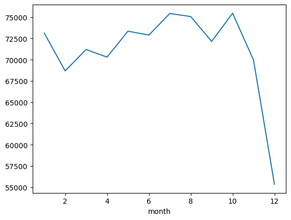
    


```python
df['Year'].value_counts().sort_index().plot(kind = 'bar')
```


    <Axes: xlabel='Year'>


    
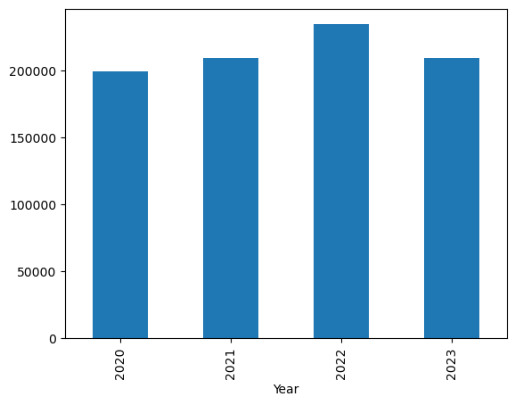
    


#### we don't need a month of 12 and year of 2023 ,12 month have very less crime record  


```python
df = df[~((df['month'] ==12) & (df['Year'] == 2023))]
```


```python
df
```


<div>
<style scoped>
    .dataframe tbody tr th:only-of-type {
        vertical-align: middle;
    }

    .dataframe tbody tr th {
        vertical-align: top;
    }

    .dataframe thead th {
        text-align: right;
    }
</style>
<table border="1" class="dataframe">
  <thead>
    <tr style="text-align: right;">
      <th></th>
      <th>division_number</th>
      <th>date_reported</th>
      <th>date_occurred</th>
      <th>area</th>
      <th>area_name</th>
      <th>reporting_district</th>
      <th>part</th>
      <th>crime_code</th>
      <th>crime_description</th>
      <th>victim_age</th>
      <th>...</th>
      <th>premise_code</th>
      <th>premise_description</th>
      <th>status</th>
      <th>status_description</th>
      <th>crime_code_1</th>
      <th>location</th>
      <th>latitude</th>
      <th>longitude</th>
      <th>Year</th>
      <th>month</th>
    </tr>
  </thead>
  <tbody>
    <tr>
      <th>0</th>
      <td>10304468</td>
      <td>2020-01-08</td>
      <td>2020-01-08 22:30:00</td>
      <td>3</td>
      <td>Southwest</td>
      <td>377</td>
      <td>2</td>
      <td>624</td>
      <td>BATTERY - SIMPLE ASSAULT</td>
      <td>36</td>
      <td>...</td>
      <td>501.0</td>
      <td>SINGLE FAMILY DWELLING</td>
      <td>AO</td>
      <td>Adult Other</td>
      <td>624.0</td>
      <td>1100 W  39TH                         PL</td>
      <td>34.0141</td>
      <td>-118.2978</td>
      <td>2020</td>
      <td>1</td>
    </tr>
    <tr>
      <th>1</th>
      <td>190101086</td>
      <td>2020-01-02</td>
      <td>2020-01-01 03:30:00</td>
      <td>1</td>
      <td>Central</td>
      <td>163</td>
      <td>2</td>
      <td>624</td>
      <td>BATTERY - SIMPLE ASSAULT</td>
      <td>25</td>
      <td>...</td>
      <td>102.0</td>
      <td>SIDEWALK</td>
      <td>IC</td>
      <td>Invest Cont</td>
      <td>624.0</td>
      <td>700 S  HILL                         ST</td>
      <td>34.0459</td>
      <td>-118.2545</td>
      <td>2020</td>
      <td>1</td>
    </tr>
    <tr>
      <th>2</th>
      <td>200110444</td>
      <td>2020-04-14</td>
      <td>2020-02-13 12:00:00</td>
      <td>1</td>
      <td>Central</td>
      <td>155</td>
      <td>2</td>
      <td>845</td>
      <td>SEX OFFENDER REGISTRANT OUT OF COMPLIANCE</td>
      <td>0</td>
      <td>...</td>
      <td>726.0</td>
      <td>POLICE FACILITY</td>
      <td>AA</td>
      <td>Adult Arrest</td>
      <td>845.0</td>
      <td>200 E  6TH                          ST</td>
      <td>34.0448</td>
      <td>-118.2474</td>
      <td>2020</td>
      <td>2</td>
    </tr>
    <tr>
      <th>3</th>
      <td>191501505</td>
      <td>2020-01-01</td>
      <td>2020-01-01 17:30:00</td>
      <td>15</td>
      <td>N Hollywood</td>
      <td>1543</td>
      <td>2</td>
      <td>745</td>
      <td>VANDALISM - MISDEAMEANOR ($399 OR UNDER)</td>
      <td>76</td>
      <td>...</td>
      <td>502.0</td>
      <td>MULTI-UNIT DWELLING (APARTMENT, DUPLEX, ETC)</td>
      <td>IC</td>
      <td>Invest Cont</td>
      <td>745.0</td>
      <td>5400    CORTEEN                      PL</td>
      <td>34.1685</td>
      <td>-118.4019</td>
      <td>2020</td>
      <td>1</td>
    </tr>
    <tr>
      <th>4</th>
      <td>191921269</td>
      <td>2020-01-01</td>
      <td>2020-01-01 04:15:00</td>
      <td>19</td>
      <td>Mission</td>
      <td>1998</td>
      <td>2</td>
      <td>740</td>
      <td>VANDALISM - FELONY ($400 &amp; OVER, ALL CHURCH VA...</td>
      <td>31</td>
      <td>...</td>
      <td>409.0</td>
      <td>BEAUTY SUPPLY STORE</td>
      <td>IC</td>
      <td>Invest Cont</td>
      <td>740.0</td>
      <td>14400    TITUS                        ST</td>
      <td>34.2198</td>
      <td>-118.4468</td>
      <td>2020</td>
      <td>1</td>
    </tr>
    <tr>
      <th>...</th>
      <td>...</td>
      <td>...</td>
      <td>...</td>
      <td>...</td>
      <td>...</td>
      <td>...</td>
      <td>...</td>
      <td>...</td>
      <td>...</td>
      <td>...</td>
      <td>...</td>
      <td>...</td>
      <td>...</td>
      <td>...</td>
      <td>...</td>
      <td>...</td>
      <td>...</td>
      <td>...</td>
      <td>...</td>
      <td>...</td>
      <td>...</td>
    </tr>
    <tr>
      <th>852945</th>
      <td>231606525</td>
      <td>2023-03-22</td>
      <td>2023-03-22 10:00:00</td>
      <td>16</td>
      <td>Foothill</td>
      <td>1602</td>
      <td>1</td>
      <td>230</td>
      <td>ASSAULT WITH DEADLY WEAPON, AGGRAVATED ASSAULT</td>
      <td>25</td>
      <td>...</td>
      <td>102.0</td>
      <td>SIDEWALK</td>
      <td>IC</td>
      <td>Invest Cont</td>
      <td>230.0</td>
      <td>12800    FILMORE                      ST</td>
      <td>34.2790</td>
      <td>-118.4116</td>
      <td>2023</td>
      <td>3</td>
    </tr>
    <tr>
      <th>852946</th>
      <td>231210064</td>
      <td>2023-04-12</td>
      <td>2023-04-12 16:30:00</td>
      <td>12</td>
      <td>77th Street</td>
      <td>1239</td>
      <td>1</td>
      <td>230</td>
      <td>ASSAULT WITH DEADLY WEAPON, AGGRAVATED ASSAULT</td>
      <td>29</td>
      <td>...</td>
      <td>222.0</td>
      <td>LAUNDROMAT</td>
      <td>IC</td>
      <td>Invest Cont</td>
      <td>230.0</td>
      <td>6100 S  VERMONT                      AV</td>
      <td>33.9841</td>
      <td>-118.2915</td>
      <td>2023</td>
      <td>4</td>
    </tr>
    <tr>
      <th>852947</th>
      <td>230115220</td>
      <td>2023-07-02</td>
      <td>2023-07-01 00:01:00</td>
      <td>1</td>
      <td>Central</td>
      <td>154</td>
      <td>1</td>
      <td>352</td>
      <td>PICKPOCKET</td>
      <td>24</td>
      <td>...</td>
      <td>735.0</td>
      <td>NIGHT CLUB (OPEN EVENINGS ONLY)</td>
      <td>IC</td>
      <td>Invest Cont</td>
      <td>352.0</td>
      <td>500 S  MAIN                         ST</td>
      <td>34.0467</td>
      <td>-118.2485</td>
      <td>2023</td>
      <td>7</td>
    </tr>
    <tr>
      <th>852948</th>
      <td>230906458</td>
      <td>2023-03-05</td>
      <td>2023-03-05 09:00:00</td>
      <td>9</td>
      <td>Van Nuys</td>
      <td>914</td>
      <td>2</td>
      <td>745</td>
      <td>VANDALISM - MISDEAMEANOR ($399 OR UNDER)</td>
      <td>53</td>
      <td>...</td>
      <td>502.0</td>
      <td>MULTI-UNIT DWELLING (APARTMENT, DUPLEX, ETC)</td>
      <td>IC</td>
      <td>Invest Cont</td>
      <td>745.0</td>
      <td>14500    HARTLAND                     ST</td>
      <td>34.1951</td>
      <td>-118.4487</td>
      <td>2023</td>
      <td>3</td>
    </tr>
    <tr>
      <th>852949</th>
      <td>230319786</td>
      <td>2023-11-10</td>
      <td>2023-11-09 23:00:00</td>
      <td>3</td>
      <td>Southwest</td>
      <td>395</td>
      <td>1</td>
      <td>331</td>
      <td>THEFT FROM MOTOR VEHICLE - GRAND ($950.01 AND ...</td>
      <td>38</td>
      <td>...</td>
      <td>501.0</td>
      <td>SINGLE FAMILY DWELLING</td>
      <td>IC</td>
      <td>Invest Cont</td>
      <td>331.0</td>
      <td>4100 S  HOBART                       BL</td>
      <td>34.0091</td>
      <td>-118.3078</td>
      <td>2023</td>
      <td>11</td>
    </tr>
  </tbody>
</table>
<p>851405 rows × 22 columns</p>
</div>


```python
df.sort_values(by = 'date_occurred')
```


<div>
<style scoped>
    .dataframe tbody tr th:only-of-type {
        vertical-align: middle;
    }

    .dataframe tbody tr th {
        vertical-align: top;
    }

    .dataframe thead th {
        text-align: right;
    }
</style>
<table border="1" class="dataframe">
  <thead>
    <tr style="text-align: right;">
      <th></th>
      <th>division_number</th>
      <th>date_reported</th>
      <th>date_occurred</th>
      <th>area</th>
      <th>area_name</th>
      <th>reporting_district</th>
      <th>part</th>
      <th>crime_code</th>
      <th>crime_description</th>
      <th>victim_age</th>
      <th>...</th>
      <th>premise_code</th>
      <th>premise_description</th>
      <th>status</th>
      <th>status_description</th>
      <th>crime_code_1</th>
      <th>location</th>
      <th>latitude</th>
      <th>longitude</th>
      <th>Year</th>
      <th>month</th>
    </tr>
  </thead>
  <tbody>
    <tr>
      <th>168264</th>
      <td>201810982</td>
      <td>2020-05-11</td>
      <td>2020-01-01 00:01:00</td>
      <td>18</td>
      <td>Southeast</td>
      <td>1822</td>
      <td>2</td>
      <td>810</td>
      <td>SEX,UNLAWFUL(INC MUTUAL CONSENT, PENETRATION W...</td>
      <td>17</td>
      <td>...</td>
      <td>501.0</td>
      <td>SINGLE FAMILY DWELLING</td>
      <td>AO</td>
      <td>Adult Other</td>
      <td>810.0</td>
      <td>400 W  CENTURY                      BL</td>
      <td>33.9456</td>
      <td>-118.2808</td>
      <td>2020</td>
      <td>1</td>
    </tr>
    <tr>
      <th>196441</th>
      <td>220706832</td>
      <td>2022-03-16</td>
      <td>2020-01-01 00:01:00</td>
      <td>7</td>
      <td>Wilshire</td>
      <td>782</td>
      <td>2</td>
      <td>668</td>
      <td>EMBEZZLEMENT, GRAND THEFT ($950.01 &amp; OVER)</td>
      <td>0</td>
      <td>...</td>
      <td>203.0</td>
      <td>OTHER BUSINESS</td>
      <td>IC</td>
      <td>Invest Cont</td>
      <td>668.0</td>
      <td>1800 S  FAIRFAX                      AV</td>
      <td>34.0431</td>
      <td>-118.3692</td>
      <td>2020</td>
      <td>1</td>
    </tr>
    <tr>
      <th>1559</th>
      <td>210708670</td>
      <td>2021-05-11</td>
      <td>2020-01-01 00:01:00</td>
      <td>7</td>
      <td>Wilshire</td>
      <td>775</td>
      <td>2</td>
      <td>812</td>
      <td>CRM AGNST CHLD (13 OR UNDER) (14-15 &amp; SUSP 10 ...</td>
      <td>13</td>
      <td>...</td>
      <td>710.0</td>
      <td>OTHER PREMISE</td>
      <td>AO</td>
      <td>Adult Other</td>
      <td>812.0</td>
      <td>1700 S  LONGWOOD                     AV</td>
      <td>34.0437</td>
      <td>-118.3440</td>
      <td>2020</td>
      <td>1</td>
    </tr>
    <tr>
      <th>199361</th>
      <td>221818077</td>
      <td>2022-09-28</td>
      <td>2020-01-01 00:01:00</td>
      <td>18</td>
      <td>Southeast</td>
      <td>1801</td>
      <td>1</td>
      <td>820</td>
      <td>ORAL COPULATION</td>
      <td>6</td>
      <td>...</td>
      <td>501.0</td>
      <td>SINGLE FAMILY DWELLING</td>
      <td>AO</td>
      <td>Adult Other</td>
      <td>812.0</td>
      <td>500 W  92ND                         ST</td>
      <td>33.9528</td>
      <td>-118.2827</td>
      <td>2020</td>
      <td>1</td>
    </tr>
    <tr>
      <th>129124</th>
      <td>201704365</td>
      <td>2020-01-02</td>
      <td>2020-01-01 00:01:00</td>
      <td>17</td>
      <td>Devonshire</td>
      <td>1761</td>
      <td>2</td>
      <td>740</td>
      <td>VANDALISM - FELONY ($400 &amp; OVER, ALL CHURCH VA...</td>
      <td>23</td>
      <td>...</td>
      <td>122.0</td>
      <td>VEHICLE, PASSENGER/TRUCK</td>
      <td>IC</td>
      <td>Invest Cont</td>
      <td>740.0</td>
      <td>9500    OWENSMOUTH                   AV</td>
      <td>34.2427</td>
      <td>-118.6021</td>
      <td>2020</td>
      <td>1</td>
    </tr>
    <tr>
      <th>...</th>
      <td>...</td>
      <td>...</td>
      <td>...</td>
      <td>...</td>
      <td>...</td>
      <td>...</td>
      <td>...</td>
      <td>...</td>
      <td>...</td>
      <td>...</td>
      <td>...</td>
      <td>...</td>
      <td>...</td>
      <td>...</td>
      <td>...</td>
      <td>...</td>
      <td>...</td>
      <td>...</td>
      <td>...</td>
      <td>...</td>
      <td>...</td>
    </tr>
    <tr>
      <th>672120</th>
      <td>230717815</td>
      <td>2023-12-01</td>
      <td>2023-11-30 23:45:00</td>
      <td>7</td>
      <td>Wilshire</td>
      <td>702</td>
      <td>1</td>
      <td>310</td>
      <td>BURGLARY</td>
      <td>30</td>
      <td>...</td>
      <td>501.0</td>
      <td>SINGLE FAMILY DWELLING</td>
      <td>IC</td>
      <td>Invest Cont</td>
      <td>310.0</td>
      <td>700 N  VISTA                        ST</td>
      <td>34.0836</td>
      <td>-118.3523</td>
      <td>2023</td>
      <td>11</td>
    </tr>
    <tr>
      <th>766816</th>
      <td>230917064</td>
      <td>2023-12-04</td>
      <td>2023-11-30 23:48:00</td>
      <td>9</td>
      <td>Van Nuys</td>
      <td>984</td>
      <td>1</td>
      <td>310</td>
      <td>BURGLARY</td>
      <td>0</td>
      <td>...</td>
      <td>501.0</td>
      <td>SINGLE FAMILY DWELLING</td>
      <td>IC</td>
      <td>Invest Cont</td>
      <td>310.0</td>
      <td>14600    SUTTON                       ST</td>
      <td>34.1477</td>
      <td>-118.4530</td>
      <td>2023</td>
      <td>11</td>
    </tr>
    <tr>
      <th>770137</th>
      <td>230221843</td>
      <td>2023-12-01</td>
      <td>2023-11-30 23:50:00</td>
      <td>2</td>
      <td>Rampart</td>
      <td>216</td>
      <td>1</td>
      <td>510</td>
      <td>VEHICLE - STOLEN</td>
      <td>0</td>
      <td>...</td>
      <td>101.0</td>
      <td>STREET</td>
      <td>IC</td>
      <td>Invest Cont</td>
      <td>510.0</td>
      <td>1000    CORONADO                     TR</td>
      <td>34.0777</td>
      <td>-118.2688</td>
      <td>2023</td>
      <td>11</td>
    </tr>
    <tr>
      <th>726894</th>
      <td>231116332</td>
      <td>2023-12-01</td>
      <td>2023-11-30 23:50:00</td>
      <td>11</td>
      <td>Northeast</td>
      <td>1132</td>
      <td>2</td>
      <td>888</td>
      <td>TRESPASSING</td>
      <td>0</td>
      <td>...</td>
      <td>203.0</td>
      <td>OTHER BUSINESS</td>
      <td>IC</td>
      <td>Invest Cont</td>
      <td>888.0</td>
      <td>3200    RIVERSIDE                    DR</td>
      <td>34.1143</td>
      <td>-118.2695</td>
      <td>2023</td>
      <td>11</td>
    </tr>
    <tr>
      <th>743649</th>
      <td>232018618</td>
      <td>2023-12-01</td>
      <td>2023-11-30 23:59:00</td>
      <td>20</td>
      <td>Olympic</td>
      <td>2044</td>
      <td>2</td>
      <td>930</td>
      <td>CRIMINAL THREATS - NO WEAPON DISPLAYED</td>
      <td>55</td>
      <td>...</td>
      <td>502.0</td>
      <td>MULTI-UNIT DWELLING (APARTMENT, DUPLEX, ETC)</td>
      <td>IC</td>
      <td>Invest Cont</td>
      <td>930.0</td>
      <td>900 S  KINGSLEY                     DR</td>
      <td>34.0559</td>
      <td>-118.3031</td>
      <td>2023</td>
      <td>11</td>
    </tr>
  </tbody>
</table>
<p>851405 rows × 22 columns</p>
</div>


```python
df.groupby(['Year', 'month']).size()
```


    Year  month
    2020  1        18496
          2        17255
          3        16165
          4        15683
          5        17204
          6        17034
          7        17121
          8        16874
          9        15639
          10       16491
          11       15574
          12       15946
    2021  1        16552
          2        15411
          3        16320
          4        16057
          5        16989
          6        17156
          7        18659
          8        18374
          9        18362
          10       19305
          11       18340
          12       17926
    2022  1        18448
          2        17700
          3        19687
          4        19784
          5        20418
          6        20201
          7        19952
          8        20081
          9        19279
          10       20274
          11       18688
          12       19924
    2023  1        19633
          2        18313
          3        19024
          4        18775
          5        18738
          6        18500
          7        19697
          8        19743
          9        18861
          10       19394
          11       17358
    dtype: int64


```python
df.groupby(['Year', 'month']).size().plot()
```


    <Axes: xlabel='Year,month'>


    
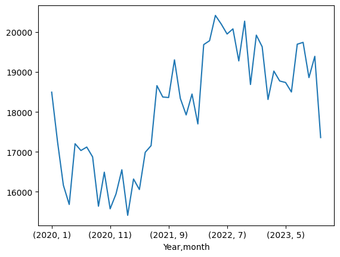
    


#### what Age persons are attend more crime


```python
## which age person attend more crime
plt.hist(df_age['victim_age'], edgecolor = 'black')
```


    (array([9.54000e+03, 1.11203e+05, 2.11588e+05, 1.42224e+05, 9.39360e+04,
            5.35240e+04, 1.56730e+04, 2.90400e+03, 4.41000e+02, 1.00000e+00]),
     array([  2. ,  13.8,  25.6,  37.4,  49.2,  61. ,  72.8,  84.6,  96.4,
            108.2, 120. ]),
     <BarContainer object of 10 artists>)


    
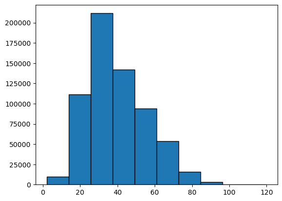
    


```python
plt.hist(df_age['victim_age'], edgecolor = 'black',bins = 15) 
```


    (array([3.96800e+03, 1.86630e+04, 9.81120e+04, 1.44858e+05, 1.22469e+05,
            8.64850e+04, 7.20760e+04, 4.59690e+04, 2.94150e+04, 1.28000e+04,
            4.50300e+03, 1.27400e+03, 4.41000e+02, 0.00000e+00, 1.00000e+00]),
     array([  2.        ,   9.86666667,  17.73333333,  25.6       ,
             33.46666667,  41.33333333,  49.2       ,  57.06666667,
             64.93333333,  72.8       ,  80.66666667,  88.53333333,
             96.4       , 104.26666667, 112.13333333, 120.        ]),
     <BarContainer object of 15 artists>)


    
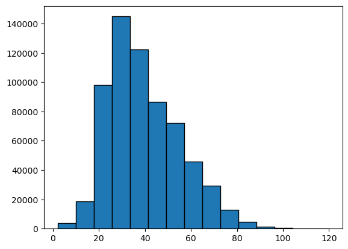
    


# Most of the crime descerption


```python
df['date_occurred_no_time'] = df['date_occurred'].dt.date
```

    C:\Users\vetri\AppData\Local\Temp\ipykernel_18140\2178151606.py:1: SettingWithCopyWarning: 
    A value is trying to be set on a copy of a slice from a DataFrame.
    Try using .loc[row_indexer,col_indexer] = value instead
    
    See the caveats in the documentation: https://pandas.pydata.org/pandas-docs/stable/user_guide/indexing.html#returning-a-view-versus-a-copy
      df['date_occurred_no_time'] = df['date_occurred'].dt.date
    


```python
df
```


<div>
<style scoped>
    .dataframe tbody tr th:only-of-type {
        vertical-align: middle;
    }

    .dataframe tbody tr th {
        vertical-align: top;
    }

    .dataframe thead th {
        text-align: right;
    }
</style>
<table border="1" class="dataframe">
  <thead>
    <tr style="text-align: right;">
      <th></th>
      <th>division_number</th>
      <th>date_reported</th>
      <th>date_occurred</th>
      <th>area</th>
      <th>area_name</th>
      <th>reporting_district</th>
      <th>part</th>
      <th>crime_code</th>
      <th>crime_description</th>
      <th>victim_age</th>
      <th>...</th>
      <th>premise_description</th>
      <th>status</th>
      <th>status_description</th>
      <th>crime_code_1</th>
      <th>location</th>
      <th>latitude</th>
      <th>longitude</th>
      <th>Year</th>
      <th>month</th>
      <th>date_occurred_no_time</th>
    </tr>
  </thead>
  <tbody>
    <tr>
      <th>0</th>
      <td>10304468</td>
      <td>2020-01-08</td>
      <td>2020-01-08 22:30:00</td>
      <td>3</td>
      <td>Southwest</td>
      <td>377</td>
      <td>2</td>
      <td>624</td>
      <td>BATTERY - SIMPLE ASSAULT</td>
      <td>36</td>
      <td>...</td>
      <td>SINGLE FAMILY DWELLING</td>
      <td>AO</td>
      <td>Adult Other</td>
      <td>624.0</td>
      <td>1100 W  39TH                         PL</td>
      <td>34.0141</td>
      <td>-118.2978</td>
      <td>2020</td>
      <td>1</td>
      <td>2020-01-08</td>
    </tr>
    <tr>
      <th>1</th>
      <td>190101086</td>
      <td>2020-01-02</td>
      <td>2020-01-01 03:30:00</td>
      <td>1</td>
      <td>Central</td>
      <td>163</td>
      <td>2</td>
      <td>624</td>
      <td>BATTERY - SIMPLE ASSAULT</td>
      <td>25</td>
      <td>...</td>
      <td>SIDEWALK</td>
      <td>IC</td>
      <td>Invest Cont</td>
      <td>624.0</td>
      <td>700 S  HILL                         ST</td>
      <td>34.0459</td>
      <td>-118.2545</td>
      <td>2020</td>
      <td>1</td>
      <td>2020-01-01</td>
    </tr>
    <tr>
      <th>2</th>
      <td>200110444</td>
      <td>2020-04-14</td>
      <td>2020-02-13 12:00:00</td>
      <td>1</td>
      <td>Central</td>
      <td>155</td>
      <td>2</td>
      <td>845</td>
      <td>SEX OFFENDER REGISTRANT OUT OF COMPLIANCE</td>
      <td>0</td>
      <td>...</td>
      <td>POLICE FACILITY</td>
      <td>AA</td>
      <td>Adult Arrest</td>
      <td>845.0</td>
      <td>200 E  6TH                          ST</td>
      <td>34.0448</td>
      <td>-118.2474</td>
      <td>2020</td>
      <td>2</td>
      <td>2020-02-13</td>
    </tr>
    <tr>
      <th>3</th>
      <td>191501505</td>
      <td>2020-01-01</td>
      <td>2020-01-01 17:30:00</td>
      <td>15</td>
      <td>N Hollywood</td>
      <td>1543</td>
      <td>2</td>
      <td>745</td>
      <td>VANDALISM - MISDEAMEANOR ($399 OR UNDER)</td>
      <td>76</td>
      <td>...</td>
      <td>MULTI-UNIT DWELLING (APARTMENT, DUPLEX, ETC)</td>
      <td>IC</td>
      <td>Invest Cont</td>
      <td>745.0</td>
      <td>5400    CORTEEN                      PL</td>
      <td>34.1685</td>
      <td>-118.4019</td>
      <td>2020</td>
      <td>1</td>
      <td>2020-01-01</td>
    </tr>
    <tr>
      <th>4</th>
      <td>191921269</td>
      <td>2020-01-01</td>
      <td>2020-01-01 04:15:00</td>
      <td>19</td>
      <td>Mission</td>
      <td>1998</td>
      <td>2</td>
      <td>740</td>
      <td>VANDALISM - FELONY ($400 &amp; OVER, ALL CHURCH VA...</td>
      <td>31</td>
      <td>...</td>
      <td>BEAUTY SUPPLY STORE</td>
      <td>IC</td>
      <td>Invest Cont</td>
      <td>740.0</td>
      <td>14400    TITUS                        ST</td>
      <td>34.2198</td>
      <td>-118.4468</td>
      <td>2020</td>
      <td>1</td>
      <td>2020-01-01</td>
    </tr>
    <tr>
      <th>...</th>
      <td>...</td>
      <td>...</td>
      <td>...</td>
      <td>...</td>
      <td>...</td>
      <td>...</td>
      <td>...</td>
      <td>...</td>
      <td>...</td>
      <td>...</td>
      <td>...</td>
      <td>...</td>
      <td>...</td>
      <td>...</td>
      <td>...</td>
      <td>...</td>
      <td>...</td>
      <td>...</td>
      <td>...</td>
      <td>...</td>
      <td>...</td>
    </tr>
    <tr>
      <th>852945</th>
      <td>231606525</td>
      <td>2023-03-22</td>
      <td>2023-03-22 10:00:00</td>
      <td>16</td>
      <td>Foothill</td>
      <td>1602</td>
      <td>1</td>
      <td>230</td>
      <td>ASSAULT WITH DEADLY WEAPON, AGGRAVATED ASSAULT</td>
      <td>25</td>
      <td>...</td>
      <td>SIDEWALK</td>
      <td>IC</td>
      <td>Invest Cont</td>
      <td>230.0</td>
      <td>12800    FILMORE                      ST</td>
      <td>34.2790</td>
      <td>-118.4116</td>
      <td>2023</td>
      <td>3</td>
      <td>2023-03-22</td>
    </tr>
    <tr>
      <th>852946</th>
      <td>231210064</td>
      <td>2023-04-12</td>
      <td>2023-04-12 16:30:00</td>
      <td>12</td>
      <td>77th Street</td>
      <td>1239</td>
      <td>1</td>
      <td>230</td>
      <td>ASSAULT WITH DEADLY WEAPON, AGGRAVATED ASSAULT</td>
      <td>29</td>
      <td>...</td>
      <td>LAUNDROMAT</td>
      <td>IC</td>
      <td>Invest Cont</td>
      <td>230.0</td>
      <td>6100 S  VERMONT                      AV</td>
      <td>33.9841</td>
      <td>-118.2915</td>
      <td>2023</td>
      <td>4</td>
      <td>2023-04-12</td>
    </tr>
    <tr>
      <th>852947</th>
      <td>230115220</td>
      <td>2023-07-02</td>
      <td>2023-07-01 00:01:00</td>
      <td>1</td>
      <td>Central</td>
      <td>154</td>
      <td>1</td>
      <td>352</td>
      <td>PICKPOCKET</td>
      <td>24</td>
      <td>...</td>
      <td>NIGHT CLUB (OPEN EVENINGS ONLY)</td>
      <td>IC</td>
      <td>Invest Cont</td>
      <td>352.0</td>
      <td>500 S  MAIN                         ST</td>
      <td>34.0467</td>
      <td>-118.2485</td>
      <td>2023</td>
      <td>7</td>
      <td>2023-07-01</td>
    </tr>
    <tr>
      <th>852948</th>
      <td>230906458</td>
      <td>2023-03-05</td>
      <td>2023-03-05 09:00:00</td>
      <td>9</td>
      <td>Van Nuys</td>
      <td>914</td>
      <td>2</td>
      <td>745</td>
      <td>VANDALISM - MISDEAMEANOR ($399 OR UNDER)</td>
      <td>53</td>
      <td>...</td>
      <td>MULTI-UNIT DWELLING (APARTMENT, DUPLEX, ETC)</td>
      <td>IC</td>
      <td>Invest Cont</td>
      <td>745.0</td>
      <td>14500    HARTLAND                     ST</td>
      <td>34.1951</td>
      <td>-118.4487</td>
      <td>2023</td>
      <td>3</td>
      <td>2023-03-05</td>
    </tr>
    <tr>
      <th>852949</th>
      <td>230319786</td>
      <td>2023-11-10</td>
      <td>2023-11-09 23:00:00</td>
      <td>3</td>
      <td>Southwest</td>
      <td>395</td>
      <td>1</td>
      <td>331</td>
      <td>THEFT FROM MOTOR VEHICLE - GRAND ($950.01 AND ...</td>
      <td>38</td>
      <td>...</td>
      <td>SINGLE FAMILY DWELLING</td>
      <td>IC</td>
      <td>Invest Cont</td>
      <td>331.0</td>
      <td>4100 S  HOBART                       BL</td>
      <td>34.0091</td>
      <td>-118.3078</td>
      <td>2023</td>
      <td>11</td>
      <td>2023-11-09</td>
    </tr>
  </tbody>
</table>
<p>851405 rows × 23 columns</p>
</div>


```python
 df['date_occurred_no_time'] = df['date_occurred'].dt.date
```

    C:\Users\vetri\AppData\Local\Temp\ipykernel_18140\3167733522.py:1: SettingWithCopyWarning: 
    A value is trying to be set on a copy of a slice from a DataFrame.
    Try using .loc[row_indexer,col_indexer] = value instead
    
    See the caveats in the documentation: https://pandas.pydata.org/pandas-docs/stable/user_guide/indexing.html#returning-a-view-versus-a-copy
      df['date_occurred_no_time'] = df['date_occurred'].dt.date
    


```python
crimeCount_per_day = df.groupby(['date_occurred_no_time' , 'crime_description']).size()
```


```python
crimeCount_per_day
```


    date_occurred_no_time  crime_description                                       
    2020-01-01             ARSON                                                        4
                           ASSAULT WITH DEADLY WEAPON, AGGRAVATED ASSAULT              47
                           ATTEMPTED ROBBERY                                            5
                           BATTERY - SIMPLE ASSAULT                                    74
                           BATTERY POLICE (SIMPLE)                                      5
                                                                                       ..
    2023-11-30             VEHICLE - ATTEMPT STOLEN                                     3
                           VEHICLE - STOLEN                                            51
                           VEHICLE, STOLEN - OTHER (MOTORIZED SCOOTERS, BIKES, ETC)     2
                           VIOLATION OF COURT ORDER                                     2
                           VIOLATION OF RESTRAINING ORDER                               7
    Length: 78408, dtype: int64


### Count of cime description


```python
crimeCount_per_day.groupby('crime_description').mean().reset_index(name = 'average_daily-count')
```


<div>
<style scoped>
    .dataframe tbody tr th:only-of-type {
        vertical-align: middle;
    }

    .dataframe tbody tr th {
        vertical-align: top;
    }

    .dataframe thead th {
        text-align: right;
    }
</style>
<table border="1" class="dataframe">
  <thead>
    <tr style="text-align: right;">
      <th></th>
      <th>crime_description</th>
      <th>average_daily-count</th>
    </tr>
  </thead>
  <tbody>
    <tr>
      <th>0</th>
      <td>ARSON</td>
      <td>2.135701</td>
    </tr>
    <tr>
      <th>1</th>
      <td>ASSAULT WITH DEADLY WEAPON ON POLICE OFFICER</td>
      <td>2.586735</td>
    </tr>
    <tr>
      <th>2</th>
      <td>ASSAULT WITH DEADLY WEAPON, AGGRAVATED ASSAULT</td>
      <td>34.114685</td>
    </tr>
    <tr>
      <th>3</th>
      <td>ATTEMPTED ROBBERY</td>
      <td>3.264207</td>
    </tr>
    <tr>
      <th>4</th>
      <td>BATTERY - SIMPLE ASSAULT</td>
      <td>47.432168</td>
    </tr>
    <tr>
      <th>...</th>
      <td>...</td>
      <td>...</td>
    </tr>
    <tr>
      <th>133</th>
      <td>VEHICLE, STOLEN - OTHER (MOTORIZED SCOOTERS, B...</td>
      <td>2.062069</td>
    </tr>
    <tr>
      <th>134</th>
      <td>VIOLATION OF COURT ORDER</td>
      <td>4.175589</td>
    </tr>
    <tr>
      <th>135</th>
      <td>VIOLATION OF RESTRAINING ORDER</td>
      <td>7.517870</td>
    </tr>
    <tr>
      <th>136</th>
      <td>VIOLATION OF TEMPORARY RESTRAINING ORDER</td>
      <td>1.384365</td>
    </tr>
    <tr>
      <th>137</th>
      <td>WEAPONS POSSESSION/BOMBING</td>
      <td>1.062500</td>
    </tr>
  </tbody>
</table>
<p>138 rows × 2 columns</p>
</div>


### Top 20 day count of crime description


```python
top_20_crimes = crimeCount_per_day.groupby('crime_description').mean().reset_index(name = 'average_daily-count')\
.sort_values(by = 'average_daily-count', ascending = False ).head(20)
```


```python
top_20_crimes
```


<div>
<style scoped>
    .dataframe tbody tr th:only-of-type {
        vertical-align: middle;
    }

    .dataframe tbody tr th {
        vertical-align: top;
    }

    .dataframe thead th {
        text-align: right;
    }
</style>
<table border="1" class="dataframe">
  <thead>
    <tr style="text-align: right;">
      <th></th>
      <th>crime_description</th>
      <th>average_daily-count</th>
    </tr>
  </thead>
  <tbody>
    <tr>
      <th>132</th>
      <td>VEHICLE - STOLEN</td>
      <td>63.830769</td>
    </tr>
    <tr>
      <th>4</th>
      <td>BATTERY - SIMPLE ASSAULT</td>
      <td>47.432168</td>
    </tr>
    <tr>
      <th>115</th>
      <td>THEFT OF IDENTITY</td>
      <td>37.331469</td>
    </tr>
    <tr>
      <th>21</th>
      <td>BURGLARY FROM VEHICLE</td>
      <td>36.718182</td>
    </tr>
    <tr>
      <th>20</th>
      <td>BURGLARY</td>
      <td>36.260839</td>
    </tr>
    <tr>
      <th>129</th>
      <td>VANDALISM - FELONY ($400 &amp; OVER, ALL CHURCH VA...</td>
      <td>36.185315</td>
    </tr>
    <tr>
      <th>2</th>
      <td>ASSAULT WITH DEADLY WEAPON, AGGRAVATED ASSAULT</td>
      <td>34.114685</td>
    </tr>
    <tr>
      <th>117</th>
      <td>THEFT PLAIN - PETTY ($950 &amp; UNDER)</td>
      <td>30.306993</td>
    </tr>
    <tr>
      <th>73</th>
      <td>INTIMATE PARTNER - SIMPLE ASSAULT</td>
      <td>29.833566</td>
    </tr>
    <tr>
      <th>113</th>
      <td>THEFT FROM MOTOR VEHICLE - PETTY ($950 &amp; UNDER)</td>
      <td>22.954545</td>
    </tr>
    <tr>
      <th>112</th>
      <td>THEFT FROM MOTOR VEHICLE - GRAND ($950.01 AND ...</td>
      <td>21.452448</td>
    </tr>
    <tr>
      <th>99</th>
      <td>ROBBERY</td>
      <td>20.374126</td>
    </tr>
    <tr>
      <th>122</th>
      <td>THEFT-GRAND ($950.01 &amp; OVER)EXCPT,GUNS,FOWL,LI...</td>
      <td>19.558741</td>
    </tr>
    <tr>
      <th>130</th>
      <td>VANDALISM - MISDEAMEANOR ($399 OR UNDER)</td>
      <td>15.772727</td>
    </tr>
    <tr>
      <th>104</th>
      <td>SHOPLIFTING - PETTY THEFT ($950 &amp; UNDER)</td>
      <td>14.421678</td>
    </tr>
    <tr>
      <th>38</th>
      <td>CRIMINAL THREATS - NO WEAPON DISPLAYED</td>
      <td>12.313986</td>
    </tr>
    <tr>
      <th>15</th>
      <td>BRANDISH WEAPON</td>
      <td>9.252448</td>
    </tr>
    <tr>
      <th>127</th>
      <td>TRESPASSING</td>
      <td>8.578322</td>
    </tr>
    <tr>
      <th>72</th>
      <td>INTIMATE PARTNER - AGGRAVATED ASSAULT</td>
      <td>8.104269</td>
    </tr>
    <tr>
      <th>135</th>
      <td>VIOLATION OF RESTRAINING ORDER</td>
      <td>7.517870</td>
    </tr>
  </tbody>
</table>
</div>


# Top 20 Crime Description


```python
plt.barh(top_20_crimes['crime_description'], top_20_crimes['average_daily-count'])
```


    <BarContainer object of 20 artists>


    
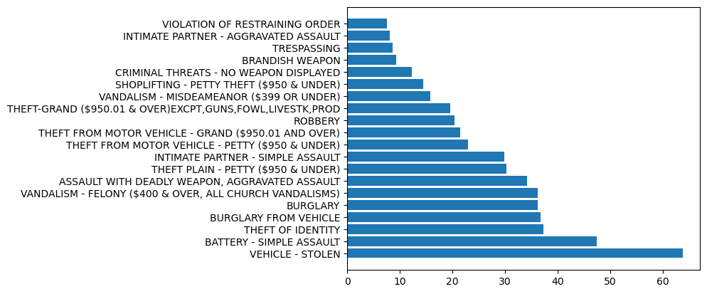
    


```python
top_20_crime_sorted = top_20_crimes.sort_values(by = 'average_daily-count', ascending = True)
```


```python
plt.barh(top_20_crime_sorted['crime_description'], top_20_crime_sorted['average_daily-count'])
```


    <BarContainer object of 20 artists>


    
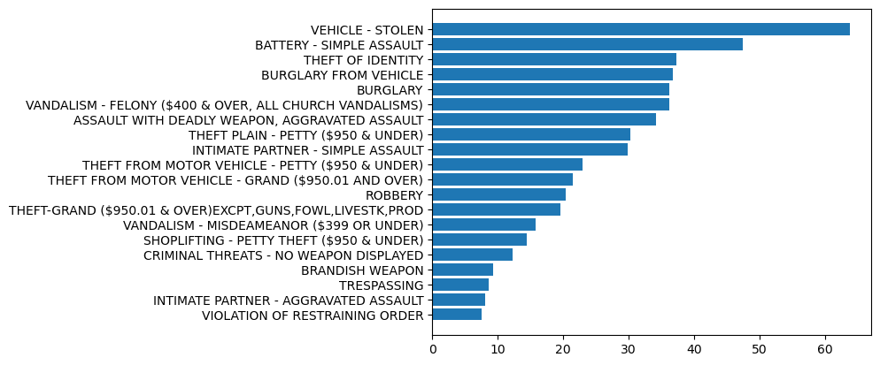
    


#### available Style


```python
plt.style.available
```


    ['Solarize_Light2',
     '_classic_test_patch',
     '_mpl-gallery',
     '_mpl-gallery-nogrid',
     'bmh',
     'classic',
     'dark_background',
     'fast',
     'fivethirtyeight',
     'ggplot',
     'grayscale',
     'seaborn-v0_8',
     'seaborn-v0_8-bright',
     'seaborn-v0_8-colorblind',
     'seaborn-v0_8-dark',
     'seaborn-v0_8-dark-palette',
     'seaborn-v0_8-darkgrid',
     'seaborn-v0_8-deep',
     'seaborn-v0_8-muted',
     'seaborn-v0_8-notebook',
     'seaborn-v0_8-paper',
     'seaborn-v0_8-pastel',
     'seaborn-v0_8-poster',
     'seaborn-v0_8-talk',
     'seaborn-v0_8-ticks',
     'seaborn-v0_8-white',
     'seaborn-v0_8-whitegrid',
     'tableau-colorblind10']


```python
plt.style.use('seaborn-v0_8-dark-palette')
```

#### top20 crime ,description of victim Age, Crime Over time


```python
plt.figure(figsize = (12,8))

# plot1 - lineChart
plt.subplot(2,2,1)
crime_plot = df.groupby(['Year', 'month']).size().plot(color = 'green',linewidth = 2)
crime_plot.set_xlabel('Year - Month', fontsize = 10)
crime_plot.set_title('Crime Over time')

#plot2 - histogram
plt.subplot(2,2,2)
plt.hist(df_age['victim_age'], edgecolor = 'black',bins = 15) 
plt.tight_layout()
plt.xlabel('Victim_Age',fontsize = 10)
plt.title('description of victim Age')

#plot3 - horizontalBar
plt.subplot(2,2,3)
plt.barh(top_20_crime_sorted['crime_description'], top_20_crime_sorted['average_daily-count'],color = 'red')
plt.title('Top 20 Crimes')

```


    Text(0.5, 1.0, 'Top 20 Crimes')


    
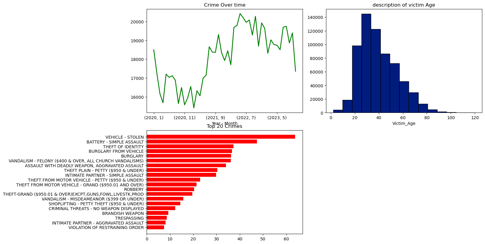
    


```python
plt.style.use('seaborn-v0_8-dark-palette')
plt.figure(figsize=(12, 8))

# Plot 1 - Line Chart
ax1 = plt.subplot(2, 2, 1)
crime_plot = df.groupby(['Year', 'month']).size()
crime_plot.plot(ax=ax1, color='green', linewidth=2)
ax1.set_xlabel('Year - Month', fontsize=10)
ax1.set_title('Crime Over Time')

# Plot 2 - Histogram
ax2 = plt.subplot(2, 2, 2)
ax2.hist(df_age['victim_age'], edgecolor='black', bins=15)
ax2.set_xlabel('Victim_Age', fontsize=10)
ax2.set_title('Description of Victim Age')

# Plot 3 - Horizontal Bar Chart
ax3 = plt.subplot(2, 2, 3)
ax3.barh(top_20_crime_sorted['crime_description'], top_20_crime_sorted['average_daily-count'], color='red')
ax3.set_title('Top 20 Crimes')

plt.tight_layout()

```


    
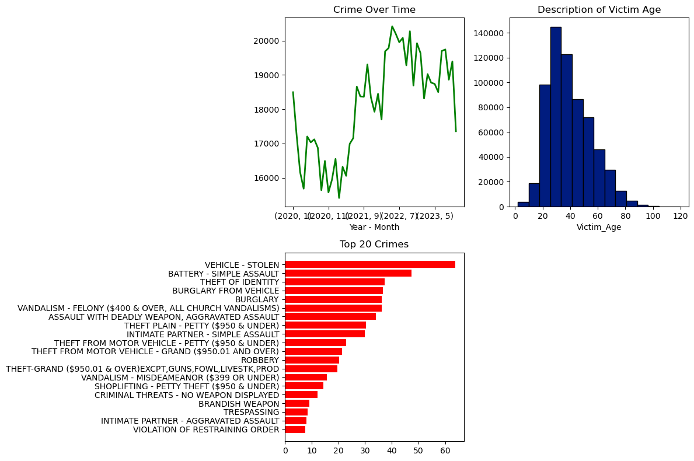
    


#### show difference in reported and occured - how long it takes the report?


```python
# show difference in reported and occured - how long it takes the report?
df
```


<div>
<style scoped>
    .dataframe tbody tr th:only-of-type {
        vertical-align: middle;
    }

    .dataframe tbody tr th {
        vertical-align: top;
    }

    .dataframe thead th {
        text-align: right;
    }
</style>
<table border="1" class="dataframe">
  <thead>
    <tr style="text-align: right;">
      <th></th>
      <th>division_number</th>
      <th>date_reported</th>
      <th>date_occurred</th>
      <th>area</th>
      <th>area_name</th>
      <th>reporting_district</th>
      <th>part</th>
      <th>crime_code</th>
      <th>crime_description</th>
      <th>victim_age</th>
      <th>...</th>
      <th>premise_description</th>
      <th>status</th>
      <th>status_description</th>
      <th>crime_code_1</th>
      <th>location</th>
      <th>latitude</th>
      <th>longitude</th>
      <th>Year</th>
      <th>month</th>
      <th>date_occurred_no_time</th>
    </tr>
  </thead>
  <tbody>
    <tr>
      <th>0</th>
      <td>10304468</td>
      <td>2020-01-08</td>
      <td>2020-01-08 22:30:00</td>
      <td>3</td>
      <td>Southwest</td>
      <td>377</td>
      <td>2</td>
      <td>624</td>
      <td>BATTERY - SIMPLE ASSAULT</td>
      <td>36</td>
      <td>...</td>
      <td>SINGLE FAMILY DWELLING</td>
      <td>AO</td>
      <td>Adult Other</td>
      <td>624.0</td>
      <td>1100 W  39TH                         PL</td>
      <td>34.0141</td>
      <td>-118.2978</td>
      <td>2020</td>
      <td>1</td>
      <td>2020-01-08</td>
    </tr>
    <tr>
      <th>1</th>
      <td>190101086</td>
      <td>2020-01-02</td>
      <td>2020-01-01 03:30:00</td>
      <td>1</td>
      <td>Central</td>
      <td>163</td>
      <td>2</td>
      <td>624</td>
      <td>BATTERY - SIMPLE ASSAULT</td>
      <td>25</td>
      <td>...</td>
      <td>SIDEWALK</td>
      <td>IC</td>
      <td>Invest Cont</td>
      <td>624.0</td>
      <td>700 S  HILL                         ST</td>
      <td>34.0459</td>
      <td>-118.2545</td>
      <td>2020</td>
      <td>1</td>
      <td>2020-01-01</td>
    </tr>
    <tr>
      <th>2</th>
      <td>200110444</td>
      <td>2020-04-14</td>
      <td>2020-02-13 12:00:00</td>
      <td>1</td>
      <td>Central</td>
      <td>155</td>
      <td>2</td>
      <td>845</td>
      <td>SEX OFFENDER REGISTRANT OUT OF COMPLIANCE</td>
      <td>0</td>
      <td>...</td>
      <td>POLICE FACILITY</td>
      <td>AA</td>
      <td>Adult Arrest</td>
      <td>845.0</td>
      <td>200 E  6TH                          ST</td>
      <td>34.0448</td>
      <td>-118.2474</td>
      <td>2020</td>
      <td>2</td>
      <td>2020-02-13</td>
    </tr>
    <tr>
      <th>3</th>
      <td>191501505</td>
      <td>2020-01-01</td>
      <td>2020-01-01 17:30:00</td>
      <td>15</td>
      <td>N Hollywood</td>
      <td>1543</td>
      <td>2</td>
      <td>745</td>
      <td>VANDALISM - MISDEAMEANOR ($399 OR UNDER)</td>
      <td>76</td>
      <td>...</td>
      <td>MULTI-UNIT DWELLING (APARTMENT, DUPLEX, ETC)</td>
      <td>IC</td>
      <td>Invest Cont</td>
      <td>745.0</td>
      <td>5400    CORTEEN                      PL</td>
      <td>34.1685</td>
      <td>-118.4019</td>
      <td>2020</td>
      <td>1</td>
      <td>2020-01-01</td>
    </tr>
    <tr>
      <th>4</th>
      <td>191921269</td>
      <td>2020-01-01</td>
      <td>2020-01-01 04:15:00</td>
      <td>19</td>
      <td>Mission</td>
      <td>1998</td>
      <td>2</td>
      <td>740</td>
      <td>VANDALISM - FELONY ($400 &amp; OVER, ALL CHURCH VA...</td>
      <td>31</td>
      <td>...</td>
      <td>BEAUTY SUPPLY STORE</td>
      <td>IC</td>
      <td>Invest Cont</td>
      <td>740.0</td>
      <td>14400    TITUS                        ST</td>
      <td>34.2198</td>
      <td>-118.4468</td>
      <td>2020</td>
      <td>1</td>
      <td>2020-01-01</td>
    </tr>
    <tr>
      <th>...</th>
      <td>...</td>
      <td>...</td>
      <td>...</td>
      <td>...</td>
      <td>...</td>
      <td>...</td>
      <td>...</td>
      <td>...</td>
      <td>...</td>
      <td>...</td>
      <td>...</td>
      <td>...</td>
      <td>...</td>
      <td>...</td>
      <td>...</td>
      <td>...</td>
      <td>...</td>
      <td>...</td>
      <td>...</td>
      <td>...</td>
      <td>...</td>
    </tr>
    <tr>
      <th>852945</th>
      <td>231606525</td>
      <td>2023-03-22</td>
      <td>2023-03-22 10:00:00</td>
      <td>16</td>
      <td>Foothill</td>
      <td>1602</td>
      <td>1</td>
      <td>230</td>
      <td>ASSAULT WITH DEADLY WEAPON, AGGRAVATED ASSAULT</td>
      <td>25</td>
      <td>...</td>
      <td>SIDEWALK</td>
      <td>IC</td>
      <td>Invest Cont</td>
      <td>230.0</td>
      <td>12800    FILMORE                      ST</td>
      <td>34.2790</td>
      <td>-118.4116</td>
      <td>2023</td>
      <td>3</td>
      <td>2023-03-22</td>
    </tr>
    <tr>
      <th>852946</th>
      <td>231210064</td>
      <td>2023-04-12</td>
      <td>2023-04-12 16:30:00</td>
      <td>12</td>
      <td>77th Street</td>
      <td>1239</td>
      <td>1</td>
      <td>230</td>
      <td>ASSAULT WITH DEADLY WEAPON, AGGRAVATED ASSAULT</td>
      <td>29</td>
      <td>...</td>
      <td>LAUNDROMAT</td>
      <td>IC</td>
      <td>Invest Cont</td>
      <td>230.0</td>
      <td>6100 S  VERMONT                      AV</td>
      <td>33.9841</td>
      <td>-118.2915</td>
      <td>2023</td>
      <td>4</td>
      <td>2023-04-12</td>
    </tr>
    <tr>
      <th>852947</th>
      <td>230115220</td>
      <td>2023-07-02</td>
      <td>2023-07-01 00:01:00</td>
      <td>1</td>
      <td>Central</td>
      <td>154</td>
      <td>1</td>
      <td>352</td>
      <td>PICKPOCKET</td>
      <td>24</td>
      <td>...</td>
      <td>NIGHT CLUB (OPEN EVENINGS ONLY)</td>
      <td>IC</td>
      <td>Invest Cont</td>
      <td>352.0</td>
      <td>500 S  MAIN                         ST</td>
      <td>34.0467</td>
      <td>-118.2485</td>
      <td>2023</td>
      <td>7</td>
      <td>2023-07-01</td>
    </tr>
    <tr>
      <th>852948</th>
      <td>230906458</td>
      <td>2023-03-05</td>
      <td>2023-03-05 09:00:00</td>
      <td>9</td>
      <td>Van Nuys</td>
      <td>914</td>
      <td>2</td>
      <td>745</td>
      <td>VANDALISM - MISDEAMEANOR ($399 OR UNDER)</td>
      <td>53</td>
      <td>...</td>
      <td>MULTI-UNIT DWELLING (APARTMENT, DUPLEX, ETC)</td>
      <td>IC</td>
      <td>Invest Cont</td>
      <td>745.0</td>
      <td>14500    HARTLAND                     ST</td>
      <td>34.1951</td>
      <td>-118.4487</td>
      <td>2023</td>
      <td>3</td>
      <td>2023-03-05</td>
    </tr>
    <tr>
      <th>852949</th>
      <td>230319786</td>
      <td>2023-11-10</td>
      <td>2023-11-09 23:00:00</td>
      <td>3</td>
      <td>Southwest</td>
      <td>395</td>
      <td>1</td>
      <td>331</td>
      <td>THEFT FROM MOTOR VEHICLE - GRAND ($950.01 AND ...</td>
      <td>38</td>
      <td>...</td>
      <td>SINGLE FAMILY DWELLING</td>
      <td>IC</td>
      <td>Invest Cont</td>
      <td>331.0</td>
      <td>4100 S  HOBART                       BL</td>
      <td>34.0091</td>
      <td>-118.3078</td>
      <td>2023</td>
      <td>11</td>
      <td>2023-11-09</td>
    </tr>
  </tbody>
</table>
<p>851405 rows × 23 columns</p>
</div>


### Time to reports,how many days to take report:


```python
# time to reports,how many days to take report:
df['Time To report'] = (pd.to_datetime(df['date_reported']) - pd.to_datetime(df['date_occurred_no_time'])).dt.days
```

    C:\Users\vetri\AppData\Local\Temp\ipykernel_18140\971574381.py:2: SettingWithCopyWarning: 
    A value is trying to be set on a copy of a slice from a DataFrame.
    Try using .loc[row_indexer,col_indexer] = value instead
    
    See the caveats in the documentation: https://pandas.pydata.org/pandas-docs/stable/user_guide/indexing.html#returning-a-view-versus-a-copy
      df['Time To report'] = (pd.to_datetime(df['date_reported']) - pd.to_datetime(df['date_occurred_no_time'])).dt.days
    


```python
df
```


<div>
<style scoped>
    .dataframe tbody tr th:only-of-type {
        vertical-align: middle;
    }

    .dataframe tbody tr th {
        vertical-align: top;
    }

    .dataframe thead th {
        text-align: right;
    }
</style>
<table border="1" class="dataframe">
  <thead>
    <tr style="text-align: right;">
      <th></th>
      <th>division_number</th>
      <th>date_reported</th>
      <th>date_occurred</th>
      <th>area</th>
      <th>area_name</th>
      <th>reporting_district</th>
      <th>part</th>
      <th>crime_code</th>
      <th>crime_description</th>
      <th>victim_age</th>
      <th>...</th>
      <th>status</th>
      <th>status_description</th>
      <th>crime_code_1</th>
      <th>location</th>
      <th>latitude</th>
      <th>longitude</th>
      <th>Year</th>
      <th>month</th>
      <th>date_occurred_no_time</th>
      <th>Time To report</th>
    </tr>
  </thead>
  <tbody>
    <tr>
      <th>0</th>
      <td>10304468</td>
      <td>2020-01-08</td>
      <td>2020-01-08 22:30:00</td>
      <td>3</td>
      <td>Southwest</td>
      <td>377</td>
      <td>2</td>
      <td>624</td>
      <td>BATTERY - SIMPLE ASSAULT</td>
      <td>36</td>
      <td>...</td>
      <td>AO</td>
      <td>Adult Other</td>
      <td>624.0</td>
      <td>1100 W  39TH                         PL</td>
      <td>34.0141</td>
      <td>-118.2978</td>
      <td>2020</td>
      <td>1</td>
      <td>2020-01-08</td>
      <td>0</td>
    </tr>
    <tr>
      <th>1</th>
      <td>190101086</td>
      <td>2020-01-02</td>
      <td>2020-01-01 03:30:00</td>
      <td>1</td>
      <td>Central</td>
      <td>163</td>
      <td>2</td>
      <td>624</td>
      <td>BATTERY - SIMPLE ASSAULT</td>
      <td>25</td>
      <td>...</td>
      <td>IC</td>
      <td>Invest Cont</td>
      <td>624.0</td>
      <td>700 S  HILL                         ST</td>
      <td>34.0459</td>
      <td>-118.2545</td>
      <td>2020</td>
      <td>1</td>
      <td>2020-01-01</td>
      <td>1</td>
    </tr>
    <tr>
      <th>2</th>
      <td>200110444</td>
      <td>2020-04-14</td>
      <td>2020-02-13 12:00:00</td>
      <td>1</td>
      <td>Central</td>
      <td>155</td>
      <td>2</td>
      <td>845</td>
      <td>SEX OFFENDER REGISTRANT OUT OF COMPLIANCE</td>
      <td>0</td>
      <td>...</td>
      <td>AA</td>
      <td>Adult Arrest</td>
      <td>845.0</td>
      <td>200 E  6TH                          ST</td>
      <td>34.0448</td>
      <td>-118.2474</td>
      <td>2020</td>
      <td>2</td>
      <td>2020-02-13</td>
      <td>61</td>
    </tr>
    <tr>
      <th>3</th>
      <td>191501505</td>
      <td>2020-01-01</td>
      <td>2020-01-01 17:30:00</td>
      <td>15</td>
      <td>N Hollywood</td>
      <td>1543</td>
      <td>2</td>
      <td>745</td>
      <td>VANDALISM - MISDEAMEANOR ($399 OR UNDER)</td>
      <td>76</td>
      <td>...</td>
      <td>IC</td>
      <td>Invest Cont</td>
      <td>745.0</td>
      <td>5400    CORTEEN                      PL</td>
      <td>34.1685</td>
      <td>-118.4019</td>
      <td>2020</td>
      <td>1</td>
      <td>2020-01-01</td>
      <td>0</td>
    </tr>
    <tr>
      <th>4</th>
      <td>191921269</td>
      <td>2020-01-01</td>
      <td>2020-01-01 04:15:00</td>
      <td>19</td>
      <td>Mission</td>
      <td>1998</td>
      <td>2</td>
      <td>740</td>
      <td>VANDALISM - FELONY ($400 &amp; OVER, ALL CHURCH VA...</td>
      <td>31</td>
      <td>...</td>
      <td>IC</td>
      <td>Invest Cont</td>
      <td>740.0</td>
      <td>14400    TITUS                        ST</td>
      <td>34.2198</td>
      <td>-118.4468</td>
      <td>2020</td>
      <td>1</td>
      <td>2020-01-01</td>
      <td>0</td>
    </tr>
    <tr>
      <th>...</th>
      <td>...</td>
      <td>...</td>
      <td>...</td>
      <td>...</td>
      <td>...</td>
      <td>...</td>
      <td>...</td>
      <td>...</td>
      <td>...</td>
      <td>...</td>
      <td>...</td>
      <td>...</td>
      <td>...</td>
      <td>...</td>
      <td>...</td>
      <td>...</td>
      <td>...</td>
      <td>...</td>
      <td>...</td>
      <td>...</td>
      <td>...</td>
    </tr>
    <tr>
      <th>852945</th>
      <td>231606525</td>
      <td>2023-03-22</td>
      <td>2023-03-22 10:00:00</td>
      <td>16</td>
      <td>Foothill</td>
      <td>1602</td>
      <td>1</td>
      <td>230</td>
      <td>ASSAULT WITH DEADLY WEAPON, AGGRAVATED ASSAULT</td>
      <td>25</td>
      <td>...</td>
      <td>IC</td>
      <td>Invest Cont</td>
      <td>230.0</td>
      <td>12800    FILMORE                      ST</td>
      <td>34.2790</td>
      <td>-118.4116</td>
      <td>2023</td>
      <td>3</td>
      <td>2023-03-22</td>
      <td>0</td>
    </tr>
    <tr>
      <th>852946</th>
      <td>231210064</td>
      <td>2023-04-12</td>
      <td>2023-04-12 16:30:00</td>
      <td>12</td>
      <td>77th Street</td>
      <td>1239</td>
      <td>1</td>
      <td>230</td>
      <td>ASSAULT WITH DEADLY WEAPON, AGGRAVATED ASSAULT</td>
      <td>29</td>
      <td>...</td>
      <td>IC</td>
      <td>Invest Cont</td>
      <td>230.0</td>
      <td>6100 S  VERMONT                      AV</td>
      <td>33.9841</td>
      <td>-118.2915</td>
      <td>2023</td>
      <td>4</td>
      <td>2023-04-12</td>
      <td>0</td>
    </tr>
    <tr>
      <th>852947</th>
      <td>230115220</td>
      <td>2023-07-02</td>
      <td>2023-07-01 00:01:00</td>
      <td>1</td>
      <td>Central</td>
      <td>154</td>
      <td>1</td>
      <td>352</td>
      <td>PICKPOCKET</td>
      <td>24</td>
      <td>...</td>
      <td>IC</td>
      <td>Invest Cont</td>
      <td>352.0</td>
      <td>500 S  MAIN                         ST</td>
      <td>34.0467</td>
      <td>-118.2485</td>
      <td>2023</td>
      <td>7</td>
      <td>2023-07-01</td>
      <td>1</td>
    </tr>
    <tr>
      <th>852948</th>
      <td>230906458</td>
      <td>2023-03-05</td>
      <td>2023-03-05 09:00:00</td>
      <td>9</td>
      <td>Van Nuys</td>
      <td>914</td>
      <td>2</td>
      <td>745</td>
      <td>VANDALISM - MISDEAMEANOR ($399 OR UNDER)</td>
      <td>53</td>
      <td>...</td>
      <td>IC</td>
      <td>Invest Cont</td>
      <td>745.0</td>
      <td>14500    HARTLAND                     ST</td>
      <td>34.1951</td>
      <td>-118.4487</td>
      <td>2023</td>
      <td>3</td>
      <td>2023-03-05</td>
      <td>0</td>
    </tr>
    <tr>
      <th>852949</th>
      <td>230319786</td>
      <td>2023-11-10</td>
      <td>2023-11-09 23:00:00</td>
      <td>3</td>
      <td>Southwest</td>
      <td>395</td>
      <td>1</td>
      <td>331</td>
      <td>THEFT FROM MOTOR VEHICLE - GRAND ($950.01 AND ...</td>
      <td>38</td>
      <td>...</td>
      <td>IC</td>
      <td>Invest Cont</td>
      <td>331.0</td>
      <td>4100 S  HOBART                       BL</td>
      <td>34.0091</td>
      <td>-118.3078</td>
      <td>2023</td>
      <td>11</td>
      <td>2023-11-09</td>
      <td>1</td>
    </tr>
  </tbody>
</table>
<p>851405 rows × 24 columns</p>
</div>


```python
#checking the values 
df['Time To report'].value_counts().head(10)
```


    Time To report
    0    419620
    1    185029
    2     52808
    3     30894
    4     19932
    5     14416
    6     10837
    7      9722
    8      7053
    9      5660
    Name: count, dtype: int64


#### crime description and time to report


```python
df.groupby(['crime_description'])['Time To report'].mean().sort_values(ascending = True).head(10)
```


    crime_description
    FAILURE TO DISPERSE                                         0.000000
    DISRUPT SCHOOL                                              0.083333
    PURSE SNATCHING - ATTEMPT                                   0.083333
    PETTY THEFT - AUTO REPAIR                                   0.125000
    LYNCHING                                                    0.157895
    FIREARMS RESTRAINING ORDER (FIREARMS RO)                    0.250000
    BOMB SCARE                                                  0.345960
    BATTERY POLICE (SIMPLE)                                     0.371023
    FIREARMS EMERGENCY PROTECTIVE ORDER (FIREARMS EPO)          0.400000
    REPLICA FIREARMS(SALE,DISPLAY,MANUFACTURE OR DISTRIBUTE)    0.500000
    Name: Time To report, dtype: float64


```python
df.groupby(['crime_description'])['Time To report'].mean().sort_values(ascending = False).head(10)
```


    crime_description
    CRM AGNST CHLD (13 OR UNDER) (14-15 & SUSP 10 YRS OLDER)    128.181013
    SEX OFFENDER REGISTRANT OUT OF COMPLIANCE                   123.779056
    SEX,UNLAWFUL(INC MUTUAL CONSENT, PENETRATION W/ FRGN OBJ    110.913921
    LEWD/LASCIVIOUS ACTS WITH CHILD                              97.324675
    DISHONEST EMPLOYEE ATTEMPTED THEFT                           87.000000
    BIGAMY                                                       77.666667
    SEXUAL PENETRATION W/FOREIGN OBJECT                          66.092946
    ORAL COPULATION                                              62.078616
    EMBEZZLEMENT, PETTY THEFT ($950 & UNDER)                     61.322581
    EMBEZZLEMENT, GRAND THEFT ($950.01 & OVER)                   59.657109
    Name: Time To report, dtype: float64


### identify the top 3 crime with the highest average victim ages:


```python
# identify the top 3 crime with the highest average victim age:
df_age.groupby('crime_description')['victim_age'].mean().reset_index().sort_values(by = 'victim_age', ascending = False).head(3)

```


<div>
<style scoped>
    .dataframe tbody tr th:only-of-type {
        vertical-align: middle;
    }

    .dataframe tbody tr th {
        vertical-align: top;
    }

    .dataframe thead th {
        text-align: right;
    }
</style>
<table border="1" class="dataframe">
  <thead>
    <tr style="text-align: right;">
      <th></th>
      <th>crime_description</th>
      <th>victim_age</th>
    </tr>
  </thead>
  <tbody>
    <tr>
      <th>45</th>
      <td>DISHONEST EMPLOYEE ATTEMPTED THEFT</td>
      <td>60.000000</td>
    </tr>
    <tr>
      <th>12</th>
      <td>BLOCKING DOOR INDUCTION CENTER</td>
      <td>54.666667</td>
    </tr>
    <tr>
      <th>77</th>
      <td>LYNCHING</td>
      <td>53.000000</td>
    </tr>
  </tbody>
</table>
</div>


#### find the area with the highest number of crimes occuring during night time:


```python
# find the area with the highest number of crimes occuring during nighttime:
nightTime_crime = df[(df['date_occurred'].dt.hour >= 20) | (df['date_occurred'].dt.hour <= 3)]
```


```python
nightTime_crime
```


<div>
<style scoped>
    .dataframe tbody tr th:only-of-type {
        vertical-align: middle;
    }

    .dataframe tbody tr th {
        vertical-align: top;
    }

    .dataframe thead th {
        text-align: right;
    }
</style>
<table border="1" class="dataframe">
  <thead>
    <tr style="text-align: right;">
      <th></th>
      <th>division_number</th>
      <th>date_reported</th>
      <th>date_occurred</th>
      <th>area</th>
      <th>area_name</th>
      <th>reporting_district</th>
      <th>part</th>
      <th>crime_code</th>
      <th>crime_description</th>
      <th>victim_age</th>
      <th>...</th>
      <th>status</th>
      <th>status_description</th>
      <th>crime_code_1</th>
      <th>location</th>
      <th>latitude</th>
      <th>longitude</th>
      <th>Year</th>
      <th>month</th>
      <th>date_occurred_no_time</th>
      <th>Time To report</th>
    </tr>
  </thead>
  <tbody>
    <tr>
      <th>0</th>
      <td>10304468</td>
      <td>2020-01-08</td>
      <td>2020-01-08 22:30:00</td>
      <td>3</td>
      <td>Southwest</td>
      <td>377</td>
      <td>2</td>
      <td>624</td>
      <td>BATTERY - SIMPLE ASSAULT</td>
      <td>36</td>
      <td>...</td>
      <td>AO</td>
      <td>Adult Other</td>
      <td>624.0</td>
      <td>1100 W  39TH                         PL</td>
      <td>34.0141</td>
      <td>-118.2978</td>
      <td>2020</td>
      <td>1</td>
      <td>2020-01-08</td>
      <td>0</td>
    </tr>
    <tr>
      <th>1</th>
      <td>190101086</td>
      <td>2020-01-02</td>
      <td>2020-01-01 03:30:00</td>
      <td>1</td>
      <td>Central</td>
      <td>163</td>
      <td>2</td>
      <td>624</td>
      <td>BATTERY - SIMPLE ASSAULT</td>
      <td>25</td>
      <td>...</td>
      <td>IC</td>
      <td>Invest Cont</td>
      <td>624.0</td>
      <td>700 S  HILL                         ST</td>
      <td>34.0459</td>
      <td>-118.2545</td>
      <td>2020</td>
      <td>1</td>
      <td>2020-01-01</td>
      <td>1</td>
    </tr>
    <tr>
      <th>5</th>
      <td>200100501</td>
      <td>2020-01-02</td>
      <td>2020-01-01 00:30:00</td>
      <td>1</td>
      <td>Central</td>
      <td>163</td>
      <td>1</td>
      <td>121</td>
      <td>RAPE, FORCIBLE</td>
      <td>25</td>
      <td>...</td>
      <td>IC</td>
      <td>Invest Cont</td>
      <td>121.0</td>
      <td>700 S  BROADWAY</td>
      <td>34.0452</td>
      <td>-118.2534</td>
      <td>2020</td>
      <td>1</td>
      <td>2020-01-01</td>
      <td>1</td>
    </tr>
    <tr>
      <th>7</th>
      <td>200100504</td>
      <td>2020-01-04</td>
      <td>2020-01-04 00:40:00</td>
      <td>1</td>
      <td>Central</td>
      <td>155</td>
      <td>2</td>
      <td>946</td>
      <td>OTHER MISCELLANEOUS CRIME</td>
      <td>0</td>
      <td>...</td>
      <td>IC</td>
      <td>Invest Cont</td>
      <td>946.0</td>
      <td>200 E  6TH                          ST</td>
      <td>34.0448</td>
      <td>-118.2474</td>
      <td>2020</td>
      <td>1</td>
      <td>2020-01-04</td>
      <td>0</td>
    </tr>
    <tr>
      <th>8</th>
      <td>200100507</td>
      <td>2020-01-04</td>
      <td>2020-01-04 02:00:00</td>
      <td>1</td>
      <td>Central</td>
      <td>101</td>
      <td>1</td>
      <td>341</td>
      <td>THEFT-GRAND ($950.01 &amp; OVER)EXCPT,GUNS,FOWL,LI...</td>
      <td>23</td>
      <td>...</td>
      <td>IC</td>
      <td>Invest Cont</td>
      <td>341.0</td>
      <td>700    BERNARD                      ST</td>
      <td>34.0677</td>
      <td>-118.2398</td>
      <td>2020</td>
      <td>1</td>
      <td>2020-01-04</td>
      <td>0</td>
    </tr>
    <tr>
      <th>...</th>
      <td>...</td>
      <td>...</td>
      <td>...</td>
      <td>...</td>
      <td>...</td>
      <td>...</td>
      <td>...</td>
      <td>...</td>
      <td>...</td>
      <td>...</td>
      <td>...</td>
      <td>...</td>
      <td>...</td>
      <td>...</td>
      <td>...</td>
      <td>...</td>
      <td>...</td>
      <td>...</td>
      <td>...</td>
      <td>...</td>
      <td>...</td>
    </tr>
    <tr>
      <th>852926</th>
      <td>230406516</td>
      <td>2023-03-19</td>
      <td>2023-03-19 01:22:00</td>
      <td>4</td>
      <td>Hollenbeck</td>
      <td>488</td>
      <td>1</td>
      <td>510</td>
      <td>VEHICLE - STOLEN</td>
      <td>0</td>
      <td>...</td>
      <td>IC</td>
      <td>Invest Cont</td>
      <td>510.0</td>
      <td>3200    GARNET                       ST</td>
      <td>34.0248</td>
      <td>-118.2076</td>
      <td>2023</td>
      <td>3</td>
      <td>2023-03-19</td>
      <td>0</td>
    </tr>
    <tr>
      <th>852927</th>
      <td>230413421</td>
      <td>2023-10-15</td>
      <td>2023-10-15 22:45:00</td>
      <td>4</td>
      <td>Hollenbeck</td>
      <td>409</td>
      <td>2</td>
      <td>624</td>
      <td>BATTERY - SIMPLE ASSAULT</td>
      <td>58</td>
      <td>...</td>
      <td>AO</td>
      <td>Adult Other</td>
      <td>624.0</td>
      <td>5100 E  HUNTINGTON DR</td>
      <td>34.0932</td>
      <td>-118.1615</td>
      <td>2023</td>
      <td>10</td>
      <td>2023-10-15</td>
      <td>0</td>
    </tr>
    <tr>
      <th>852930</th>
      <td>231514016</td>
      <td>2023-08-27</td>
      <td>2023-08-27 00:30:00</td>
      <td>15</td>
      <td>N Hollywood</td>
      <td>1548</td>
      <td>1</td>
      <td>761</td>
      <td>BRANDISH WEAPON</td>
      <td>38</td>
      <td>...</td>
      <td>AO</td>
      <td>Adult Other</td>
      <td>761.0</td>
      <td>11000    MCCORMICK                    ST</td>
      <td>34.1660</td>
      <td>-118.3705</td>
      <td>2023</td>
      <td>8</td>
      <td>2023-08-27</td>
      <td>0</td>
    </tr>
    <tr>
      <th>852947</th>
      <td>230115220</td>
      <td>2023-07-02</td>
      <td>2023-07-01 00:01:00</td>
      <td>1</td>
      <td>Central</td>
      <td>154</td>
      <td>1</td>
      <td>352</td>
      <td>PICKPOCKET</td>
      <td>24</td>
      <td>...</td>
      <td>IC</td>
      <td>Invest Cont</td>
      <td>352.0</td>
      <td>500 S  MAIN                         ST</td>
      <td>34.0467</td>
      <td>-118.2485</td>
      <td>2023</td>
      <td>7</td>
      <td>2023-07-01</td>
      <td>1</td>
    </tr>
    <tr>
      <th>852949</th>
      <td>230319786</td>
      <td>2023-11-10</td>
      <td>2023-11-09 23:00:00</td>
      <td>3</td>
      <td>Southwest</td>
      <td>395</td>
      <td>1</td>
      <td>331</td>
      <td>THEFT FROM MOTOR VEHICLE - GRAND ($950.01 AND ...</td>
      <td>38</td>
      <td>...</td>
      <td>IC</td>
      <td>Invest Cont</td>
      <td>331.0</td>
      <td>4100 S  HOBART                       BL</td>
      <td>34.0091</td>
      <td>-118.3078</td>
      <td>2023</td>
      <td>11</td>
      <td>2023-11-09</td>
      <td>1</td>
    </tr>
  </tbody>
</table>
<p>269794 rows × 24 columns</p>
</div>


#### finding the most crime area


```python
nightTime_crime['area_name'].value_counts()
```


    area_name
    Central        18873
    77th Street    17568
    Hollywood      15741
    Pacific        15328
    Southwest      14819
    Southeast      14638
    Olympic        14256
    Newton         13843
    N Hollywood    13428
    Rampart        13047
    Wilshire       11665
    Harbor         11623
    Northeast      11379
    West Valley    11351
    West LA        11012
    Van Nuys       10964
    Mission        10813
    Hollenbeck     10425
    Devonshire     10172
    Topanga        10104
    Foothill        8745
    Name: count, dtype: int64


```python
hourly_crime = df['date_occurred'].dt.hour.value_counts().sort_index()
```


```python
hourly_crime
```


    date_occurred
    0     35061
    1     25740
    2     21801
    3     19040
    4     16099
    5     14829
    6     19484
    7     21985
    8     31428
    9     30812
    10    36461
    11    36967
    12    57683
    13    38422
    14    41494
    15    44394
    16    44754
    17    49492
    18    50606
    19    46701
    20    47399
    21    43270
    22    41704
    23    35779
    Name: count, dtype: int64


```python
hourly_crime = df['date_occurred'].dt.hour.value_counts().sort_index().reset_index()
```


```python
# bar of maximum time of crime 
```


```python
plt.bar(hourly_crime['date_occurred'],hourly_crime['count'])
```


    <BarContainer object of 24 artists>


    
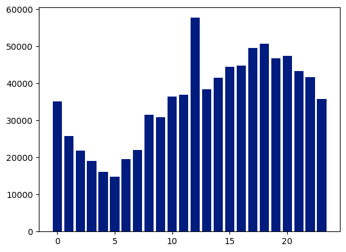
    


### 12am to 1am crime time counts


```python
# 12am to 1am crime happend time
```


```python
df[df['date_occurred'].dt.hour == 12]['crime_description'].value_counts()
```


    crime_description
    THEFT OF IDENTITY                               9098
    VEHICLE - STOLEN                                4048
    BATTERY - SIMPLE ASSAULT                        3958
    THEFT PLAIN - PETTY ($950 & UNDER)              3785
    BURGLARY                                        2945
                                                    ... 
    DRUGS, TO A MINOR                                  1
    THEFT, COIN MACHINE - GRAND ($950.01 & OVER)       1
    BIGAMY                                             1
    GRAND THEFT / INSURANCE FRAUD                      1
    INCITING A RIOT                                    1
    Name: count, Length: 124, dtype: int64


#### crime_description and theft of identity


```python
no_identi_theft = df[~(df['crime_description']== 'THEFT OF IDENTITY')]
```


```python
no_identi_theft
```


<div>
<style scoped>
    .dataframe tbody tr th:only-of-type {
        vertical-align: middle;
    }

    .dataframe tbody tr th {
        vertical-align: top;
    }

    .dataframe thead th {
        text-align: right;
    }
</style>
<table border="1" class="dataframe">
  <thead>
    <tr style="text-align: right;">
      <th></th>
      <th>division_number</th>
      <th>date_reported</th>
      <th>date_occurred</th>
      <th>area</th>
      <th>area_name</th>
      <th>reporting_district</th>
      <th>part</th>
      <th>crime_code</th>
      <th>crime_description</th>
      <th>victim_age</th>
      <th>...</th>
      <th>status</th>
      <th>status_description</th>
      <th>crime_code_1</th>
      <th>location</th>
      <th>latitude</th>
      <th>longitude</th>
      <th>Year</th>
      <th>month</th>
      <th>date_occurred_no_time</th>
      <th>Time To report</th>
    </tr>
  </thead>
  <tbody>
    <tr>
      <th>0</th>
      <td>10304468</td>
      <td>2020-01-08</td>
      <td>2020-01-08 22:30:00</td>
      <td>3</td>
      <td>Southwest</td>
      <td>377</td>
      <td>2</td>
      <td>624</td>
      <td>BATTERY - SIMPLE ASSAULT</td>
      <td>36</td>
      <td>...</td>
      <td>AO</td>
      <td>Adult Other</td>
      <td>624.0</td>
      <td>1100 W  39TH                         PL</td>
      <td>34.0141</td>
      <td>-118.2978</td>
      <td>2020</td>
      <td>1</td>
      <td>2020-01-08</td>
      <td>0</td>
    </tr>
    <tr>
      <th>1</th>
      <td>190101086</td>
      <td>2020-01-02</td>
      <td>2020-01-01 03:30:00</td>
      <td>1</td>
      <td>Central</td>
      <td>163</td>
      <td>2</td>
      <td>624</td>
      <td>BATTERY - SIMPLE ASSAULT</td>
      <td>25</td>
      <td>...</td>
      <td>IC</td>
      <td>Invest Cont</td>
      <td>624.0</td>
      <td>700 S  HILL                         ST</td>
      <td>34.0459</td>
      <td>-118.2545</td>
      <td>2020</td>
      <td>1</td>
      <td>2020-01-01</td>
      <td>1</td>
    </tr>
    <tr>
      <th>2</th>
      <td>200110444</td>
      <td>2020-04-14</td>
      <td>2020-02-13 12:00:00</td>
      <td>1</td>
      <td>Central</td>
      <td>155</td>
      <td>2</td>
      <td>845</td>
      <td>SEX OFFENDER REGISTRANT OUT OF COMPLIANCE</td>
      <td>0</td>
      <td>...</td>
      <td>AA</td>
      <td>Adult Arrest</td>
      <td>845.0</td>
      <td>200 E  6TH                          ST</td>
      <td>34.0448</td>
      <td>-118.2474</td>
      <td>2020</td>
      <td>2</td>
      <td>2020-02-13</td>
      <td>61</td>
    </tr>
    <tr>
      <th>3</th>
      <td>191501505</td>
      <td>2020-01-01</td>
      <td>2020-01-01 17:30:00</td>
      <td>15</td>
      <td>N Hollywood</td>
      <td>1543</td>
      <td>2</td>
      <td>745</td>
      <td>VANDALISM - MISDEAMEANOR ($399 OR UNDER)</td>
      <td>76</td>
      <td>...</td>
      <td>IC</td>
      <td>Invest Cont</td>
      <td>745.0</td>
      <td>5400    CORTEEN                      PL</td>
      <td>34.1685</td>
      <td>-118.4019</td>
      <td>2020</td>
      <td>1</td>
      <td>2020-01-01</td>
      <td>0</td>
    </tr>
    <tr>
      <th>4</th>
      <td>191921269</td>
      <td>2020-01-01</td>
      <td>2020-01-01 04:15:00</td>
      <td>19</td>
      <td>Mission</td>
      <td>1998</td>
      <td>2</td>
      <td>740</td>
      <td>VANDALISM - FELONY ($400 &amp; OVER, ALL CHURCH VA...</td>
      <td>31</td>
      <td>...</td>
      <td>IC</td>
      <td>Invest Cont</td>
      <td>740.0</td>
      <td>14400    TITUS                        ST</td>
      <td>34.2198</td>
      <td>-118.4468</td>
      <td>2020</td>
      <td>1</td>
      <td>2020-01-01</td>
      <td>0</td>
    </tr>
    <tr>
      <th>...</th>
      <td>...</td>
      <td>...</td>
      <td>...</td>
      <td>...</td>
      <td>...</td>
      <td>...</td>
      <td>...</td>
      <td>...</td>
      <td>...</td>
      <td>...</td>
      <td>...</td>
      <td>...</td>
      <td>...</td>
      <td>...</td>
      <td>...</td>
      <td>...</td>
      <td>...</td>
      <td>...</td>
      <td>...</td>
      <td>...</td>
      <td>...</td>
    </tr>
    <tr>
      <th>852945</th>
      <td>231606525</td>
      <td>2023-03-22</td>
      <td>2023-03-22 10:00:00</td>
      <td>16</td>
      <td>Foothill</td>
      <td>1602</td>
      <td>1</td>
      <td>230</td>
      <td>ASSAULT WITH DEADLY WEAPON, AGGRAVATED ASSAULT</td>
      <td>25</td>
      <td>...</td>
      <td>IC</td>
      <td>Invest Cont</td>
      <td>230.0</td>
      <td>12800    FILMORE                      ST</td>
      <td>34.2790</td>
      <td>-118.4116</td>
      <td>2023</td>
      <td>3</td>
      <td>2023-03-22</td>
      <td>0</td>
    </tr>
    <tr>
      <th>852946</th>
      <td>231210064</td>
      <td>2023-04-12</td>
      <td>2023-04-12 16:30:00</td>
      <td>12</td>
      <td>77th Street</td>
      <td>1239</td>
      <td>1</td>
      <td>230</td>
      <td>ASSAULT WITH DEADLY WEAPON, AGGRAVATED ASSAULT</td>
      <td>29</td>
      <td>...</td>
      <td>IC</td>
      <td>Invest Cont</td>
      <td>230.0</td>
      <td>6100 S  VERMONT                      AV</td>
      <td>33.9841</td>
      <td>-118.2915</td>
      <td>2023</td>
      <td>4</td>
      <td>2023-04-12</td>
      <td>0</td>
    </tr>
    <tr>
      <th>852947</th>
      <td>230115220</td>
      <td>2023-07-02</td>
      <td>2023-07-01 00:01:00</td>
      <td>1</td>
      <td>Central</td>
      <td>154</td>
      <td>1</td>
      <td>352</td>
      <td>PICKPOCKET</td>
      <td>24</td>
      <td>...</td>
      <td>IC</td>
      <td>Invest Cont</td>
      <td>352.0</td>
      <td>500 S  MAIN                         ST</td>
      <td>34.0467</td>
      <td>-118.2485</td>
      <td>2023</td>
      <td>7</td>
      <td>2023-07-01</td>
      <td>1</td>
    </tr>
    <tr>
      <th>852948</th>
      <td>230906458</td>
      <td>2023-03-05</td>
      <td>2023-03-05 09:00:00</td>
      <td>9</td>
      <td>Van Nuys</td>
      <td>914</td>
      <td>2</td>
      <td>745</td>
      <td>VANDALISM - MISDEAMEANOR ($399 OR UNDER)</td>
      <td>53</td>
      <td>...</td>
      <td>IC</td>
      <td>Invest Cont</td>
      <td>745.0</td>
      <td>14500    HARTLAND                     ST</td>
      <td>34.1951</td>
      <td>-118.4487</td>
      <td>2023</td>
      <td>3</td>
      <td>2023-03-05</td>
      <td>0</td>
    </tr>
    <tr>
      <th>852949</th>
      <td>230319786</td>
      <td>2023-11-10</td>
      <td>2023-11-09 23:00:00</td>
      <td>3</td>
      <td>Southwest</td>
      <td>395</td>
      <td>1</td>
      <td>331</td>
      <td>THEFT FROM MOTOR VEHICLE - GRAND ($950.01 AND ...</td>
      <td>38</td>
      <td>...</td>
      <td>IC</td>
      <td>Invest Cont</td>
      <td>331.0</td>
      <td>4100 S  HOBART                       BL</td>
      <td>34.0091</td>
      <td>-118.3078</td>
      <td>2023</td>
      <td>11</td>
      <td>2023-11-09</td>
      <td>1</td>
    </tr>
  </tbody>
</table>
<p>798021 rows × 24 columns</p>
</div>


```python
no_identi_theft = df[~(df['crime_description']== 'THEFT OF IDENTITY')]
```


```python
no_identi_theft['date_occurred'].dt.hour.value_counts().sort_index().reset_index()
```


<div>
<style scoped>
    .dataframe tbody tr th:only-of-type {
        vertical-align: middle;
    }

    .dataframe tbody tr th {
        vertical-align: top;
    }

    .dataframe thead th {
        text-align: right;
    }
</style>
<table border="1" class="dataframe">
  <thead>
    <tr style="text-align: right;">
      <th></th>
      <th>date_occurred</th>
      <th>count</th>
    </tr>
  </thead>
  <tbody>
    <tr>
      <th>0</th>
      <td>0</td>
      <td>29406</td>
    </tr>
    <tr>
      <th>1</th>
      <td>1</td>
      <td>24243</td>
    </tr>
    <tr>
      <th>2</th>
      <td>2</td>
      <td>21095</td>
    </tr>
    <tr>
      <th>3</th>
      <td>3</td>
      <td>18501</td>
    </tr>
    <tr>
      <th>4</th>
      <td>4</td>
      <td>15671</td>
    </tr>
    <tr>
      <th>5</th>
      <td>5</td>
      <td>14208</td>
    </tr>
    <tr>
      <th>6</th>
      <td>6</td>
      <td>16157</td>
    </tr>
    <tr>
      <th>7</th>
      <td>7</td>
      <td>19844</td>
    </tr>
    <tr>
      <th>8</th>
      <td>8</td>
      <td>27771</td>
    </tr>
    <tr>
      <th>9</th>
      <td>9</td>
      <td>27752</td>
    </tr>
    <tr>
      <th>10</th>
      <td>10</td>
      <td>33407</td>
    </tr>
    <tr>
      <th>11</th>
      <td>11</td>
      <td>34179</td>
    </tr>
    <tr>
      <th>12</th>
      <td>12</td>
      <td>48585</td>
    </tr>
    <tr>
      <th>13</th>
      <td>13</td>
      <td>35787</td>
    </tr>
    <tr>
      <th>14</th>
      <td>14</td>
      <td>39016</td>
    </tr>
    <tr>
      <th>15</th>
      <td>15</td>
      <td>42042</td>
    </tr>
    <tr>
      <th>16</th>
      <td>16</td>
      <td>42811</td>
    </tr>
    <tr>
      <th>17</th>
      <td>17</td>
      <td>47707</td>
    </tr>
    <tr>
      <th>18</th>
      <td>18</td>
      <td>49154</td>
    </tr>
    <tr>
      <th>19</th>
      <td>19</td>
      <td>45605</td>
    </tr>
    <tr>
      <th>20</th>
      <td>20</td>
      <td>46435</td>
    </tr>
    <tr>
      <th>21</th>
      <td>21</td>
      <td>42449</td>
    </tr>
    <tr>
      <th>22</th>
      <td>22</td>
      <td>41045</td>
    </tr>
    <tr>
      <th>23</th>
      <td>23</td>
      <td>35151</td>
    </tr>
  </tbody>
</table>
</div>


#### Analyzing Crime Frequency Based on Hourly Occurrence


```python
new_hourly_count = no_identi_theft['date_occurred'].dt.hour.value_counts().sort_index().reset_index()
```


```python
plt.bar(new_hourly_count['date_occurred'], new_hourly_count['count'], color = 'Red')
```


    <BarContainer object of 24 artists>


    
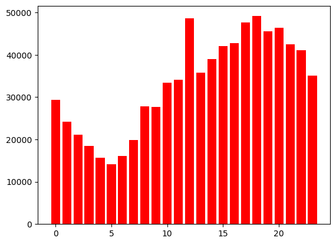
    


```python
no_identi_theft[no_identi_theft['date_occurred'].dt.hour == 12]['crime_description'].value_counts()
```


    crime_description
    VEHICLE - STOLEN                                           4048
    BATTERY - SIMPLE ASSAULT                                   3958
    THEFT PLAIN - PETTY ($950 & UNDER)                         3785
    BURGLARY                                                   2945
    VANDALISM - FELONY ($400 & OVER, ALL CHURCH VANDALISMS)    2587
                                                               ... 
    DRUGS, TO A MINOR                                             1
    THEFT, COIN MACHINE - GRAND ($950.01 & OVER)                  1
    BIGAMY                                                        1
    GRAND THEFT / INSURANCE FRAUD                                 1
    INCITING A RIOT                                               1
    Name: count, Length: 123, dtype: int64


```python
plt.bar(no_identi_theft['date_occurred'],no_identi_theft['crime_description'])
```

## Conclusion


```python
#### 🧾 Conclusion
After analyzing the LA crime data, several key insights were observed:

Peak Crime Hours: Most crimes occurred during [insert specific hours if you identified them], indicating high-risk times during the day.

Top Crime Types: The most common types of crimes were [e.g., theft, assault, burglary], suggesting areas where law enforcement might focus efforts.

Location Patterns: Certain regions/neighborhoods showed consistently high crime rates, which could benefit from increased surveillance or community programs.

Temporal Patterns: Crime rates varied significantly by time of day and day of the week, with [insert patterns, e.g., weekends or late nights] being the most active.

These insights can support city officials, police departments, and community planners in making data-driven decisions to reduce crime and improve public safety.

Would you like me to write a personalized conclusion based on the actual data from your notebook? If yes, just let me know what columns/analysis you’ve done, or I can guide you to extract the final insights!

```
